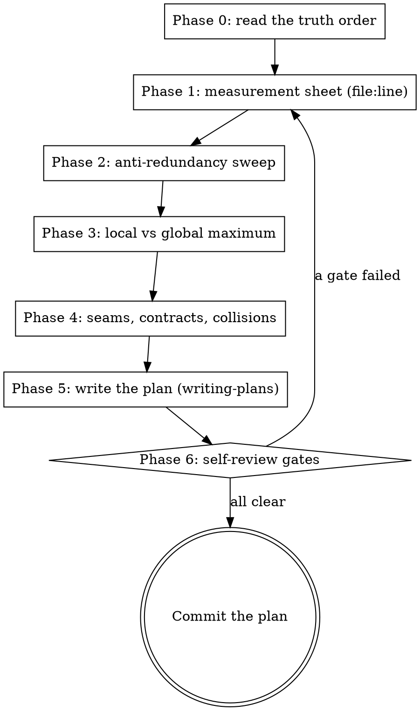

# Marketplace Central — Planning Methodology

## Why this exists

Every plan is an **allegation about the repository**, and allegations rot. In this repo,
plans written from memory have:

- built a second pricing engine beside the one that already worked (P2.b, 17 tasks → 7);
- hand-rolled a scheduler beside `syncapp.Scheduler`, discarding failure visibility (F-A3 Slice B);
- named a database column that does not exist (`sync_state.last_success_at`);
- asserted `toBeInTheDocument()` where the defect was a *wrong value*, so the whole test net
  passed over it for months;
- turned an unknown into `0` or `4%` and shipped it to the operator as a fact.

None of those were coding mistakes. All of them were **planning** mistakes, and all of them
were cheap to catch by measuring first. That is the whole method: *measure, refute, then write*.

**Announce at start:** "Using mc-planning to measure the ground before writing the plan."

## The order



Phases 1–4 are **reads and greps**, not prose. Do not start writing tasks until the sheet is
filled. A gate failure in Phase 6 sends you back to measuring, not to rewording.

Create one TodoWrite item per phase so a long planning session cannot silently skip one.

## Phase 0 — Read the truth order

Truth is ordered, and a conflict between two of these is a **stop-and-classify**, never a
judgment call you make silently in the plan:

`ARCHITECTURE.md` / ADRs > OpenAPI + `packages/sdk-runtime` > `contracts/governance/` >
wiki > `.mnfs/` > tests / builds / commits.

Read, at minimum: [ARCHITECTURE.md](ARCHITECTURE.md) frozen decisions, the design/spec that
motivates the plan, and [docs/HARNESS-PROFILE.md](docs/HARNESS-PROFILE.md) §2 (lanes), §6
(shared seams), §7 (non-negotiables).

If the plan touches a module you have not read this session, read its `ports/` directory
first. Ports are the contract; `application/` is one implementation of it.

`references/repo-map.md` carries the measured anchors (module layout, seam owners, lane
commands, registry files) so you don't rediscover them. Read it before Phase 1.

## Phase 1 — The measurement sheet

Answer all eight **with a `file:line`**. "I believe", "presumably", and "it should" are not
answers. If you cannot cite a line, you have not measured it, and the plan must either
measure it or declare the unknown explicitly as a risk with the measurement that would
settle it.

1. **What exists today that already does part of this?** (`grep` the concept, not the name.)
2. **Where does the defect/gap actually live?** Not where it is *visible* — where it is
   *caused*. A wrong string on a screen is usually a wrong function in a package.
3. **Who else consumes that code path?** Every call site of the thing you will change.
4. **What does the contract already say?** OpenAPI operation, SDK method, port signature —
   including operations that exist and have **zero** call sites.
5. **What is the real live state?** Query the dev database, hit the endpoint, read the row.
   Column names get *measured* (`\d table`), never recalled.
6. **What proves it is broken today, and what will prove it fixed?** Name the observable
   before you name the fix.
7. **What is the cost budget?** Provider calls per run against the shared rate bucket, rows
   scanned, extra queries per page render.
8. **What breaks silently if this fails at 3 a.m.?** If the answer is "nothing visible", the
   plan is incomplete — failure visibility is part of the feature, not a follow-up.

Write the eight answers into the plan itself, in a `## Medição` section above the tasks. The
executor inherits your measurements; without them they will re-derive and get it wrong.

## Phase 2 — Anti-redundancy sweep

Before any task creates a calculation, helper, hook, component, endpoint, port, table or
job, cite the `file:line` of the nearest existing thing and state **why it does not serve**.
Concretely, run these and read the hits:

```bash
grep -rn "<the concept, 2-3 spellings>" apps packages contracts --include=*.go --include=*.ts --include=*.tsx --include=*.yaml
```

Three findings that recur here, so look for them by name:

- **The copy-pasted ladder.** A relative-time formatter existed in three files with three
  slightly different thresholds. The fix was one shared function, not a fourth copy.
- **The twin component.** Two `FreshnessIndicator`s with different `aria-label`s meant every
  label-based test was silently bound to whichever copy its file imported.
- **The orphan contract operation.** An endpoint fully wired end-to-end (handler → OpenAPI →
  SDK) with zero web call sites. Adding a second endpoint would have been the redundancy;
  the work was one button.

A new artifact with no citation is a plan defect, not a style preference.

## Phase 3 — Local maximum vs global maximum

Frozen decision 11: *global-maximum design beats local patches*. The test is mechanical —
ask all four, and answer in the plan:

1. **How many copies of this concept exist?** ≥2 means the fix belongs where they converge,
   not in the one you happened to open.
2. **Is the cause one layer below the symptom?** If the screen is wrong because a shared
   package is wrong, patching the screen is the local maximum and hides the other call sites.
3. **Does a seam already exist for this?** Registering a job on `syncapp.Scheduler` versus
   building a second ticker; implementing an existing port versus inventing a parallel one.
   Reusing the seam inherits its reconciliation, isolation and — the one that matters —
   its **failure visibility**.
4. **Am I extending legacy to solve a current problem?** VTEX abstractions must not be
   extended for Mercado Livre work. Legacy gets inventoried and left alone, or removed in
   its own slice — never grown.

When the global fix is larger, **say so and take it anyway**, scoped honestly: the plan
states the blast radius, lists every call site touched, and puts the refactor in its own
committed task ahead of the feature task. A refactor deferred "for later" in this repo has
never happened later.

If the global fix is genuinely out of scope, the plan records it as a **named debt** in
`.mnfs/HARNESS-DEBTS.md` with the measurement that proves it, not as a comment.

## Phase 4 — Seams, contracts, collisions

Work through `references/checklist.md` — it is the exhaustive list, organized by area, and
too long to inline here. Read the sections that apply to what you are planning:

| Planning… | Read section |
|---|---|
| A Go module, service, port, adapter | Architecture & boundaries; Data & migrations |
| Anything the browser reaches | Contract seam (OpenAPI ↔ SDK ↔ handler); Frontend |
| A provider (Mercado Livre / Oracle) touch | Integration & provider |
| A scheduled job, sync, poller | Sync & scheduling; Failure visibility |
| Tests of any kind | Verification lanes; Test-design traps |
| Anything at all | Honest-value rules; Evidence & debts; Collision adjudication |

Two things are never skippable, whatever the change:

- **Contract atomicity.** OpenAPI and `packages/sdk-runtime` land in the **same commit**
  (`GOV_API_SDK_SPLIT`). Plan them as one task, never two.
- **Collision adjudication by measurement.** Before claiming two tracks are disjoint, run
  `git worktree list` and `git diff --name-only main...<branch>` for each in-flight branch
  and show the empty intersection. Assumed disjointness has produced merge-time reverts.

## Phase 5 — Write the plan

Now invoke **superpowers:writing-plans** and follow it: bite-sized steps, exact paths,
complete code in every step, red-before-green, frequent commits, no placeholders. This
skill does not replace it — it front-loads the measurement it assumes you already did.

Repo-specific shape on top of writing-plans:

- **Header** carries `## Medição` (Phase 1's eight answers) and `## O que já existe`
  (Phase 2's citations) before Task 1. An executor who reads only the header must be able to
  tell what is true about the repo today.
- **Every executable claim is measured.** Lane commands, symbol names, column names,
  signatures, line anchors — a plan that hands the executor a command that does not run, or
  a column that does not exist, costs a full round. Prefer anchoring by **content**
  (route, `operationId`, schema name, function name) over line numbers, which rot across
  branches; when a line number is necessary, name the tree it was measured in.
- **Red before green, with a named negative control.** The failing test comes first, the step
  that runs it and shows the exact failure text comes second. A step that says "verify it
  fails" without the expected message is not a control.
- **The live drive is a task, not a footnote.** It names the URL, the click path, the exact
  rendered text expected, and its precondition: the running container was built from a
  commit at or after the slice's. A stale binary makes absence-of-defect and
  absence-of-code look identical.
- **Debts close explicitly.** A final task lists the debt IDs this plan discharges and the
  ones it leaves open, with the measurement each rests on.

## Phase 6 — Self-review gates

Re-read the finished plan against these. Any "no" sends you back to the measuring phases.

- [ ] Every `file:line` in the plan was actually opened this session, not recalled.
- [ ] No new artifact without a Phase-2 citation of what exists and why it doesn't serve.
- [ ] The local-vs-global question is answered in writing, not implied.
- [ ] No hardcoded business constant. Rates, fees, TTLs, tariffs, tax percentages and
      company codes come from configuration, the database or the provider — never a literal.
      "Temporary" literals have shipped and stayed.
- [ ] No unknown becomes `0`, `""`, `false` or a plausible default (ADR-17). Unknowns get an
      explicit state and surface as such.
- [ ] No mock or stub stands in for an integration seam. Mocks prove contract behavior only.
      Composition roots ship no permanent stub/nil wiring on a live path.
- [ ] Every assertion in the plan's tests would **fail** on the current code. Presence
      assertions that pass with any value are not tests of value.
- [ ] Someone else's test that the plan changes is **restored or restated**, never deleted.
- [ ] OpenAPI + SDK are in one task, one commit.
- [ ] `tenant_id` predicate is present in every query the plan writes.
- [ ] Failure of anything the plan adds is visible to the operator on a screen, with the
      path from failure to pixel named.
- [ ] Provider call budget stated against the shared rate bucket if the plan calls a provider.
- [ ] Lane commands copy-paste and run, with their working directory: the FE vitest lane is
      `cd apps/web` first; Go lanes bind an absolute `GOCACHE` from `apps/server_core`.
- [ ] Governance side effects planned: new module → `contracts/governance/modules.json`;
      new migration → unique prefix **and** the hardcoded count fixture in
      `internal/platform/migrate/runner_test.go`.
- [ ] Nothing in the plan pushes, resets, reverts, stashes, cleans, installs dependencies as
      a ritual, dumps an environment, writes to Oracle, or performs a live provider write
      without naming the operator authorization it requires.

Then run writing-plans' own self-review (spec coverage, placeholder scan, type consistency)
and commit the plan.

## Reference files

- `references/repo-map.md` — measured anchors: module layout, seams and their owners, lane
  commands, governance registries, where things actually live. Read before Phase 1.
- `references/checklist.md` — the exhaustive per-area checklist for Phase 4, with a table of
  contents. Read the sections your change touches.
- `references/anti-patterns.md` — the catalogue of defects this repo actually shipped, each
  with the measurement that would have caught it. Read when a plan feels finished, as a
  last adversarial pass.
