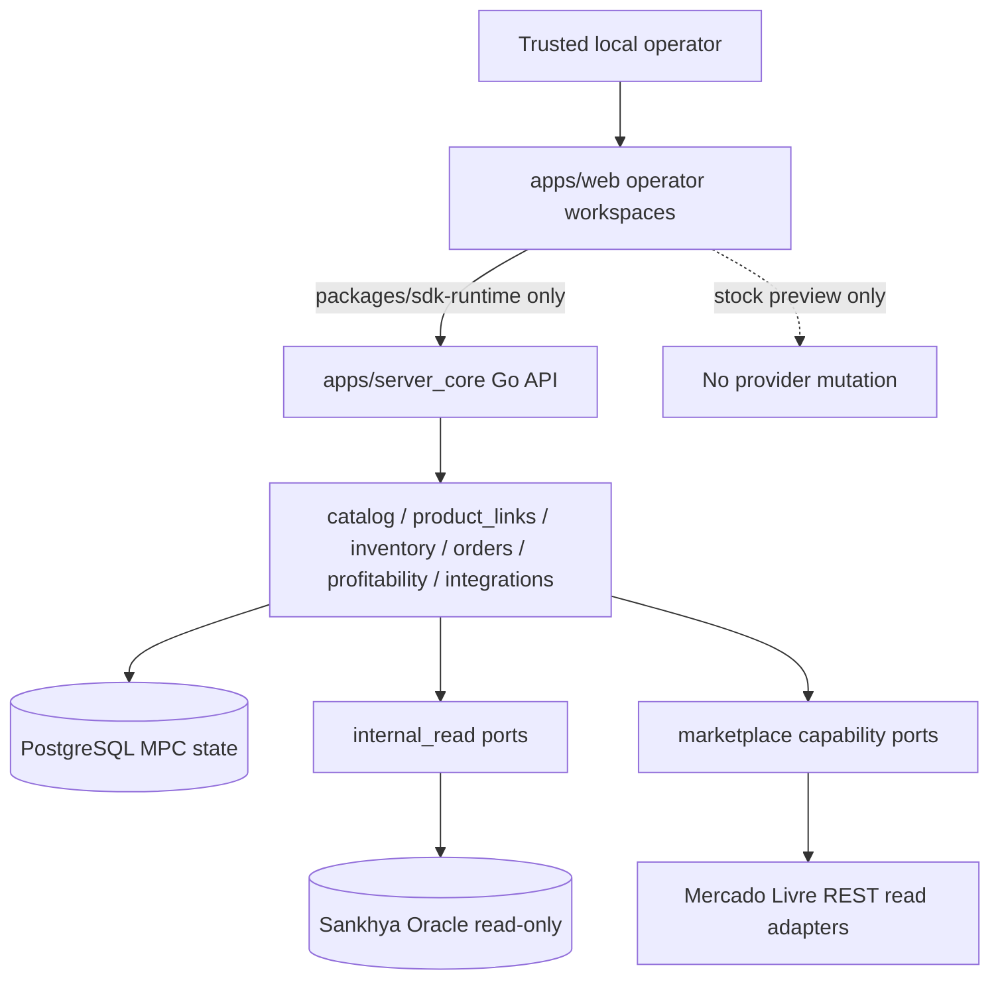
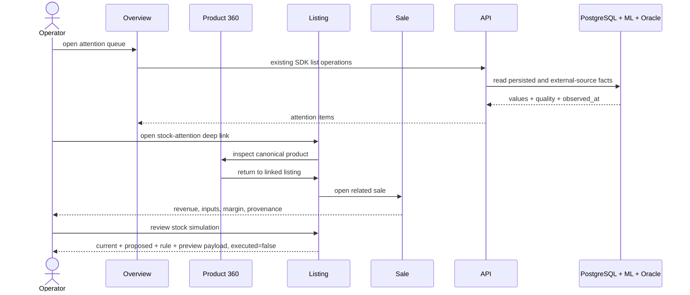
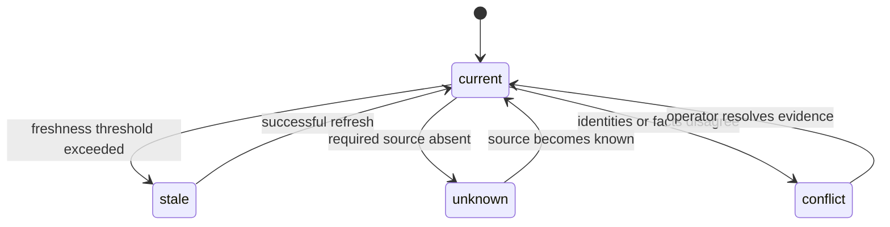
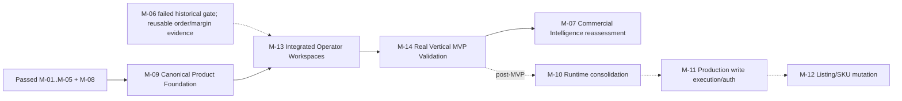

# Architecture Map — MVP Replan

```yaml
id: AM-001
type: architecture-map
status: planned
owner: Mission Strategist
parent: MIS-001
created: 2026-07-06
updated: 2026-07-13
validation_level: QA-0
lifecycle_scope: support
```

This file visualizes `mission.md` and IC-003. Those artifacts remain authoritative.

## Runtime topology



## Operator journey



## Shared state vocabulary



## Build order


