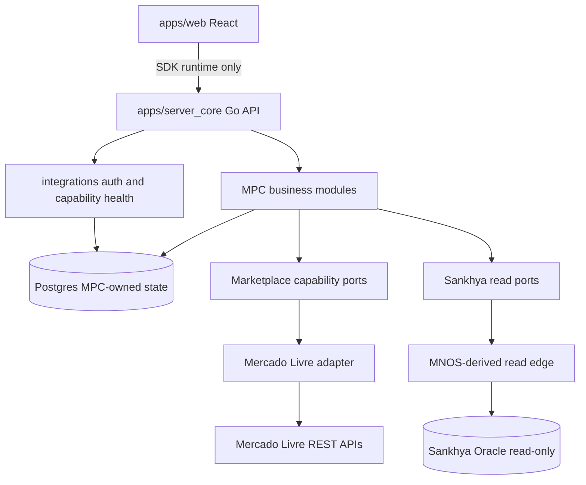
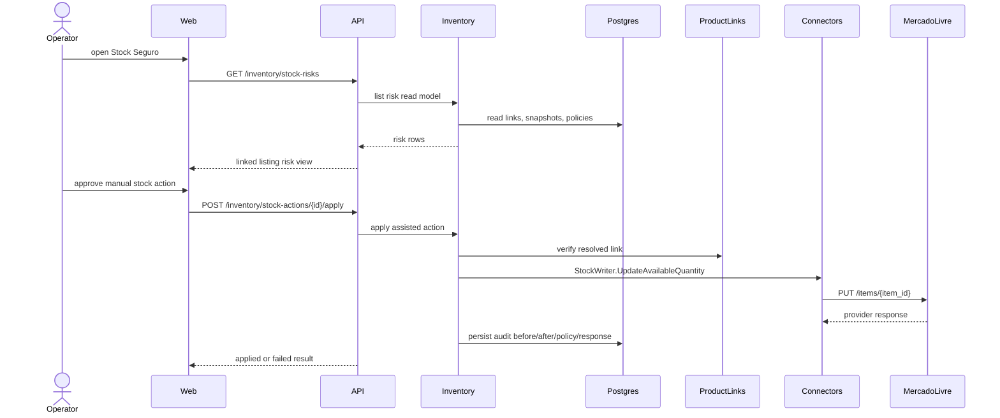
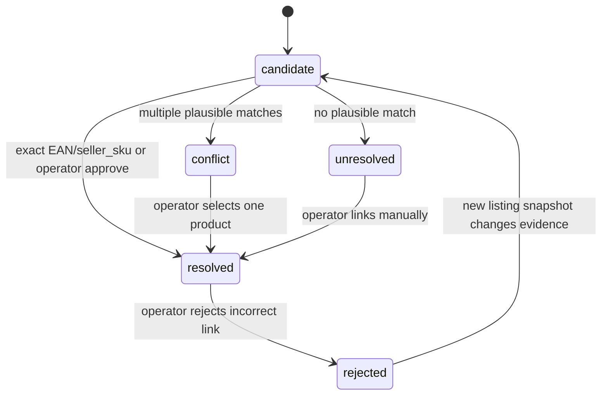
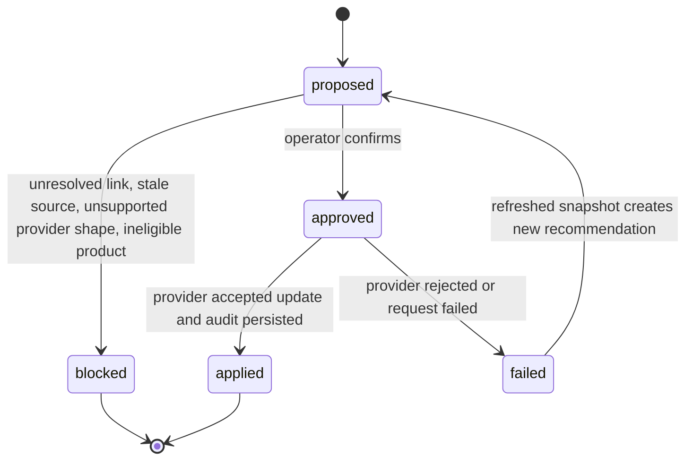
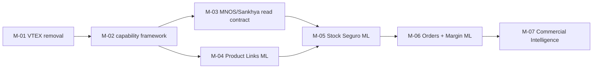

# Architecture Map

```yaml
id: AM-001
type: architecture-map
status: planned
owner: Mission Strategist
parent: MIS-001
created: 2026-07-06
updated: 2026-07-06
validation_level: QA-0
lifecycle_scope: support
```

## Topology



## Stock Seguro Flow



## Link Lifecycle



## Stock Action Lifecycle



## Build Order



## Truth Notes

- Interface contracts own field names, route namespaces, error codes, and capability semantics.
- This map visualizes mission contracts only; feature execution must preserve the referenced contracts.
