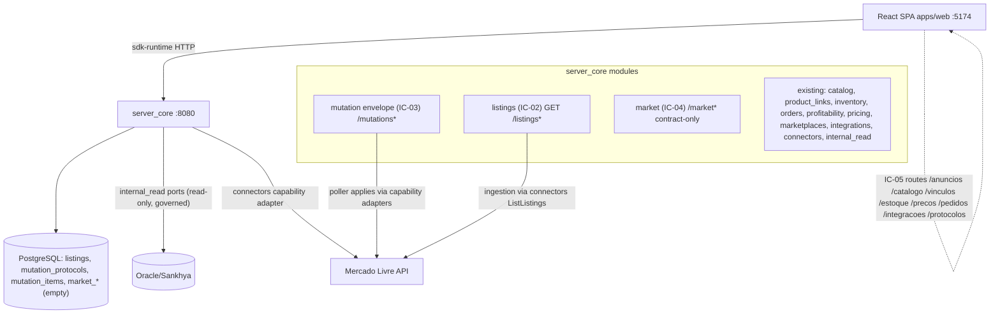
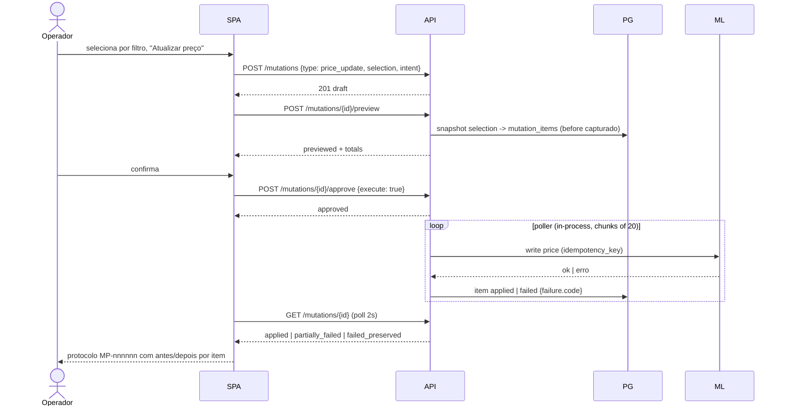
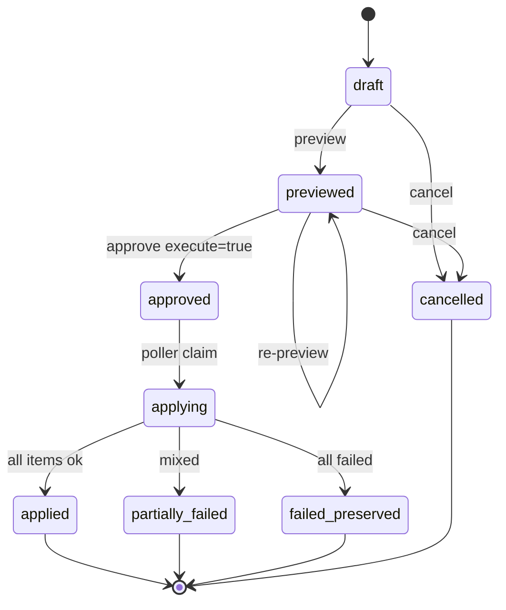
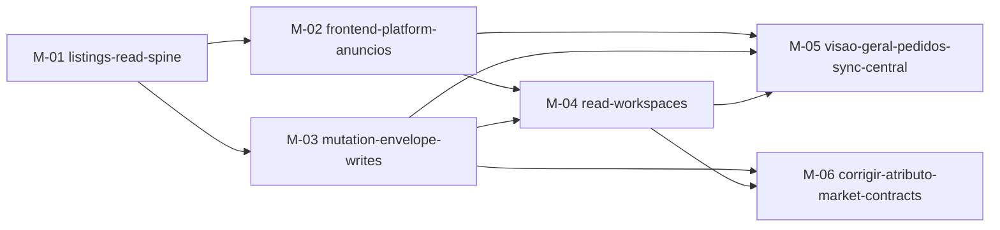

# MIS-003 Architecture Map

View of the contracts (IC-02..05, mission.md ADRs). Not a source of truth.

## Topology

## Behavior flow — corrigir preço em massa (IC-03)

## Lifecycle — MutationProtocol (IC-03 enum, exact)

Retry never re-enters this machine: it clones retryable failed items into a NEW protocol.

## Build order (mission.md Milestone Strategy, exact)

