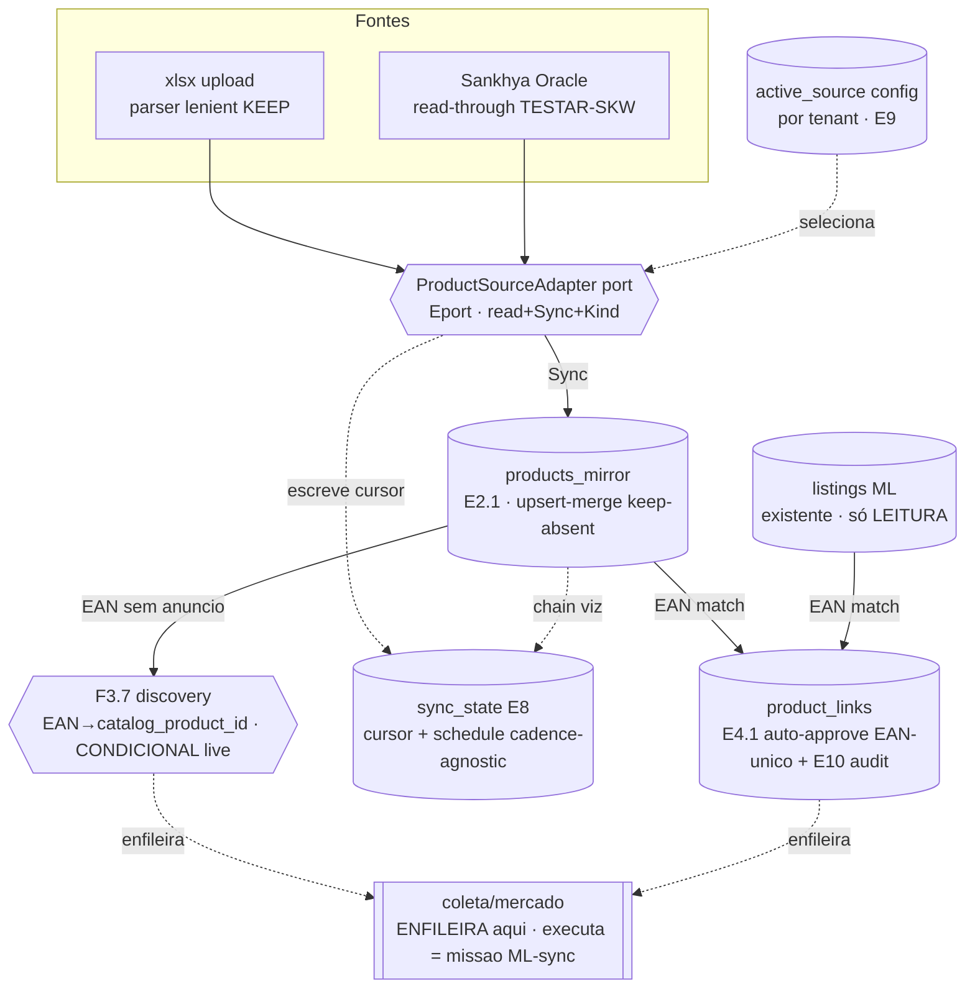

# Architecture Map — MIS-006-integracao-fundacao

Vista dos contratos (não fonte paralela). Detalhe em `mission.md`, `interface-contracts-mis006.md`,
`docs/design/SYSTEM-BLUEPRINT.md`.

## Fluxo alvo (produto → mirror → vínculo/mercado)



## DAG de milestones (dependência + paralelismo)

```mermaid
flowchart LR
  M01[M-01 sync_state+scheduler skeleton]
  M02[M-02 mirror+port+active-source]
  M03[M-03 XlsxAdapter]
  M04[M-04 SankhyaAdapter]
  M05[M-05 auto-vinculo]
  M06[M-06 telas+SDK]
  M07[M-07 F3.7 discovery CONDICIONAL]

  M01 -.additive-lock root.go.- M02
  M01 --> M03
  M02 --> M03
  M02 --> M04
  M03 --> M05
  M02 --> M05
  M01 --> M06
  M02 --> M06
  M05 --> M06
  M02 --> M07
  LIVE{{live T13-T16<br/>REQUEST hub}} --> M07
```

**Ondas:**
- Onda 1: **M-01 ∥ M-02** (root.go = additive-lock: M-02 dono / M-01 append tickers; fallback serial).
- Onda 2: **M-03 ∥ M-04** (pacotes disjuntos: `erp_import/*` vs `internal_read/adapters/oracle`).
- Onda 3: **M-05** (após M-03: hook de import dispara link-gen; mirror populado prova live).
- Onda 4: **M-06** (após M-01+M-02+M-05).
- **M-07**: paralelo às ondas 2-4, após M-02 + prova live (SKW=Oracle, F3.7=ML).

Caminho crítico: **M-02 → M-03 → M-05 → M-06**.

## Superfícies compartilhadas (owners)

| Seam | Dono | Regra |
|---|---|---|
| `composition/root.go` | M-02 (source-wiring) | M-01 additive-lock no bloco de tickers (~:575-577); hub resolve merge |
| `erp_import/*` | M-03 | M-02 congela source-KIND domain antes |
| `internal_read/ports` | M-02 (formaliza port) | M-04 implementa (serial M-02→M-04) |
| `internal_read/adapters/cache` key | M-04 | extend cache-key ATÔMICO com adição de sankhya (nunca split) |
| `product_links/*` | M-05 | depende de mirror (M-02) + hook import (M-03) |
| `market/application` (discovery half) | M-07 | só enfileira; execução = missão ML-sync |
| OpenAPI + `sdk-runtime` | hub contract-lock | M-02 (config endpoint) + M-06 (chain-read) seções disjuntas |
| `apps/web` AppRouter/nav | M-06 | route `/importacoes` + promover `ImportacaoSection` compartilhado |
| Migrações | hub aloca blocos | bloco A (sync_state) < bloco B (mirror+config+E10 audit) < bloco C (M-07 condicional: `product_catalog_identity` NOVA, só gate PASS, nunca ALTER mirror) — Fase 0 antes |
