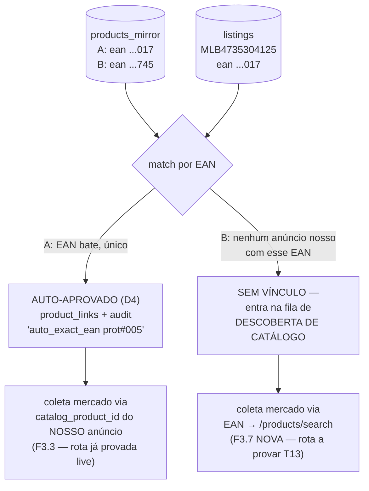

# Cenário Fio-a-Fio — 2 Produtos Atravessando o Sistema Inteiro

Simulação passo-a-passo de TUDO, com base nos contratos (E1–E7), no catálogo de consultas
(F1–F5) e no schema. Dois produtos reais em perfil, um por fonte:

| | **Produto A — Sankhya** | **Produto B — xlsx** |
|---|---|---|
| codigo_produto | `90008` | `74606` |
| descricao | Torneira Cozinha Mesa Bica Móvel | Misturador Monocamando Lavatório Docol |
| ean | `7891234500017` | `7897586000745` |
| custo | R$ 82,00 | R$ 410,00 |
| estoque | 120 (local: CD-01) | 35 (local: LOJA) |
| preco (tabela ERP) | R$ 169,00 | R$ 899,00 |
| marca / grupo | Ferragens / Torneiras | Docol / Misturadores |
| situação no ML | **JÁ TEMOS anúncio** (MLB4735304125) | **NÃO anunciamos** → candidato a Oportunidade |

A regra que responde a dúvida: **FE nunca lê "o mirror" cru — lê VIEWS derivadas por join.**
Oportunidades = `products_mirror` (catálogo completo do ERP) **MENOS** `product_links`
(o que já anunciamos) **JOIN** demanda coletada do ML. Sem o mirror não existe "o que a gente
PODERIA anunciar" — anúncios só conhecem o que JÁ existe no ML.

---

## FASE 1 — Entrada no sistema (fontes diferentes, mesmo destino)

### Produto A (Sankhya, fonte tipo-banco)
1. Operador em `/integracoes` ativa fonte `sankhya` (config por tenant, gravada no DB).
2. Scheduler (ou botão "Sincronizar agora") dispara SankhyaAdapter:
   query Oracle `TGFPRO ⋈ TGFEST ⋈ TGFCUS ⋈ TGFBAR` [TESTAR-SKW] → linhas E2.
3. Upsert em `products_mirror`: `(tenant, 90008) → {custo 82.00, estoque 120, ean 789...017, ...}`.
   `sync_state(products)` grava cursor + timestamp.
4. `/importacoes` mostra: "Sync Sankhya 14:32 — 1.847 produtos (12 novos, 96 custos alterados)".

### Produto B (xlsx, fonte tipo-arquivo)
1. Operador em `/integracoes` sobe `catalogo.xlsx` → protocolo `#005-E` criado.
2. Parser leniente: aliases PT, preâmbulo, multi-sheet → linhas E2 em `erp_import_products`
   (histórico imutável do protocolo). Campo ausente = NULL honesto, nunca 0.
3. Rebuild de `products_mirror` a partir do snapshot: `(tenant, 74606) → {custo 410.00, ...}`.
4. `/importacoes` mostra protocolo #005-E: "2.012 linhas, 2.009 válidas, 3 sem código (ignoradas)".

**Estado após Fase 1: A e B são INDISTINGUÍVEIS.** Mesma tabela, mesmo modelo E2, mesma cadeia
downstream. Fonte só importa para auditoria (`source` na linha) e estratégia de refresh.

---

## FASE 2 — Vínculo automático (onde A e B divergem)

Gatilho: todo rebuild/sync do mirror + todo backfill de anúncios dispara geração de candidatos.



**Produto A:** EAN `...017` bate exatamente com 1 anúncio nosso → vínculo auto-aprovado, audit
gravado, coleta de mercado enfileirada. `/importacoes` mostra: "1 vínculo novo (auto)".

**Produto B:** nenhum anúncio nosso tem EAN `...745`. NÃO é erro — é o insumo de Oportunidades.
Entra em `sync_state(catalog_discovery)`: fila de descoberta por EAN.

> **ADENDO 1 (novo na arquitetura): F3.7 `descobrir_produto_catalogo(ean)`**
> `GET /products/search?site_id=MLB&status=active&product_identifier={EAN}` → catalog_product_id.
> Sem essa função, Oportunidades só funciona pra produto que JÁ anunciamos — que é
> exatamente o bug conceitual de hoje (a tela mostrava oportunidade de ANÚNCIO, não de PRODUTO).
> É a única rota de demanda para produto sem anúncio. Precisa de prova live (rodada T13–T16).

---

## FASE 3 — Coleta de mercado (as duas rotas)

### Produto A (vinculado — rota provada)
1. Nosso anúncio MLB4735304125 tem `catalog_product_id = MLB15531385` (veio no multiget T1).
2. `GET /products/MLB15531385/items` → 4 ofertas: nós (R$ 169) + 3 concorrentes
   (R$ 154,90 / R$ 161 / R$ 189). Nossa oferta EXCLUÍDA dos agregados (fix M5).
3. `sellers_cache`: `/users/{seller}` público → "MAPRON..." nível 3_yellow, 416 transações.
4. `market_aggregates` para codprod 90008: min R$ 154,90, mediana R$ 161, 3 concorrentes,
   buy-box winner item_id + collected_at.

### Produto B (sem anúncio — rota nova)
1. Fila de descoberta: `GET /products/search?product_identifier=7897586000745` →
   `catalog_product_id = MLB22624877` (ou vazio → produto não catalogável, ver Adendo 3).
2. Mesma sequência de A a partir daqui: `/products/{id}/items` → 5 ofertas R$ 780–950,
   sellers, agregados. Grava `market_aggregates` para codprod 74606 —
   **produto que NÃO anunciamos agora tem dados de demanda.**

---

## FASE 4 — O que cada tela mostra agora

### /mercado — aba Radar (produto A, vinculado)
| coluna | valor | vem de |
|---|---|---|
| Produto | 90008 Torneira... | `products_mirror` |
| NOSSO PREÇO | R$ 169,00 (do anúncio, NÃO custo — fix M2) | `listings.price` via link |
| Melhor concorrente | R$ 154,90 (MAPRON, 3_yellow) | `competitor_offers` + `sellers_cache` |
| Posição | 3º de 4 | agregado |
| Coletado | há 2h | `market_aggregates.collected_at` (fix M4) |

### /mercado — aba OPORTUNIDADES (produto B — a resposta da tua dúvida)
| coluna | valor | vem de |
|---|---|---|
| Produto | 74606 Misturador Docol | `products_mirror` **sem** `product_links` |
| Estoque / Custo | 35 un / R$ 410 | `products_mirror` |
| Mercado | 5 vendedores, R$ 780–950 | `market_aggregates` via descoberta EAN |
| Margem potencial | venda a R$ 849 → ~R$ 214 líq. (tarifa real `ml_tariffs` + frete) | simulador sobre agregados |
| Veredicto | **"Você não anuncia — criar anúncio?"** | derivado |
| Volume | proxy: líder tem 4.400 transações históricas | `sellers_cache` (limite T8: sold_quantity de terceiro não existe) |

Query da tela (join canônico, ~zero custo de leitura):
```sql
SELECT pm.*, ma.*
FROM products_mirror pm
JOIN market_aggregates ma ON ma.codprod = pm.codigo_produto
LEFT JOIN product_links pl ON pl.internal_product_id = pm.codigo_produto
WHERE pl.link_id IS NULL          -- só o que NÃO anunciamos
  AND pm.estoque_total > 0        -- só o que dá pra vender
ORDER BY ma.margem_potencial DESC
```

### /precos (ambos)
A: simula com custo 82 + tarifa real + frete + concorrência (faixa piso/alvo).
B: mesma simulação ANTES de criar anúncio — decisão informada.

### /pedidos (produto A vendeu)
Pedido chega no sync 5min → ingest F2 completo (shipment, /sla, costs, billing) →
decomposição persistida: `R$ 169 − 27,89 comissão(16,5% unid.) − 19,85 frete − 82 custo
= R$ 39,26 líquido (23%)`. Fila: bucket + SLA `expected_date` do `/sla`.

---

## FASE 5 — Ciclo de vida contínuo
- Sankhya sync muda custo de A p/ R$ 95 → mirror atualiza → margem recalculada em /precos e
  na decomposição de pedidos NOVOS (pedido antigo mantém custo congelado da época).
- xlsx novo protocolo #006-E sem produto B → mirror rebuild marca B ausente
  (política: soft-flag `absent_in_last_snapshot`, nunca delete silencioso).
- Operador cria anúncio do produto B no ML → próximo backfill de anúncios traz →
  match EAN → vínculo auto → B SAI de Oportunidades e ENTRA no Radar. Ciclo fechado.

---

## ADENDOS (adversarial — o que pode furar e como validamos)

**A1. F3.7 é hipótese até provar.** `/products/search?product_identifier=` documentado mas nunca
testado por nós — e T8/F2 provou que ML bloqueia endpoints sem aviso (PolicyAgent). Rodada live
obrigatória antes de ratificar (abaixo).

**A2. Cobertura de EAN é o teto de Oportunidades.** Produto sem EAN no ERP OU EAN fora do
catálogo ML = invisível para descoberta. Mitigação honesta: contador na tela ("1.203 de 2.009
produtos com EAN pesquisável; 806 sem EAN — enriquecer cadastro"). NUNCA silenciar.

**A3. Produto não-catalogável.** Nem toda categoria ML tem catálogo. `/products/search` vazio ≠
sem demanda. Fase 2 da descoberta (rodada futura): busca pública por palavra-chave — PODE estar
bloqueada como /items (mesmo PolicyAgent). Testar T15 antes de prometer.

**A4. Volume de descoberta.** 2.009 produtos × 1 call de search = 2.009 calls no primeiro sync
(depois só delta de EANs novos). Com budget de rate provado (T12: 100 concorrentes sem 429),
viável em minutos — mas fila com prioridade (estoque × custo desc) e cursor em `sync_state`.

**A5. Preço da oferta concorrente pode divergir do preço real** (promoções/canais — memória
ML: sale_price precisa `?context=channel_marketplace`). Coleta grava o que veio da oferta +
timestamp; simulador rotula "preço observado em {data}".

**A6. Custo NULL quebra o ranking de margem — e é o caso REAL do prospect.** O produto B do
exemplo tem custo R$410, mas o prospect real (#004-E, 2.012 produtos) veio com custo/estoque
NULL honesto. Então "margem potencial" e o `ORDER BY ma.margem_potencial` da query de
Oportunidades não computam para esses. Decisão a ratificar: Oportunidade com custo desconhecido
aparece assim mesmo, ranqueada por DEMANDA (nº concorrentes / preço mediano) e rotulada
"margem indisponível — custo não informado", NUNCA sumida nem com custo=0 forjado (ADR-17).
Dois modos de ordenação na tela: por margem (só quem tem custo) e por demanda (todos).

**A7. Mesmo codprod nas duas fontes = colisão no mirror.** `products_mirror` tem PK
`codigo_produto` com `source` só como coluna. Se 90008 existe em Sankhya E no xlsx, um sobrescreve
o outro. Como a fonte ativa é única por tenant (config no DB), o rebuild troca o mirror inteiro —
então na prática só uma fonte popula por vez. Consequência a assumir: **trocar de fonte ativa =
swap total do catálogo**, e os resultados de Oportunidades mudam em bloco. Não misturar linhas de
fontes diferentes no mesmo mirror sem um discriminador na PK (decisão: manter single-source por
tenant, não merge).

**A8. Vínculo auto-aprovado precisa ser idempotente.** Mesmo EAN reimportado (protocolo novo) ou
re-scan de anúncios não pode gerar vínculo duplicado nem re-abrir vínculo que o operador rejeitou
à mão. Chave: `(internal_product_id, provider_listing_id)` única + respeitar override manual no
audit. Já é lição de chips passados; formalizar no gerador.

**A9. Anúncio nosso SEM EAN que é o mesmo produto B.** Se já temos um anúncio sem EAN que na
verdade É o produto B, a descoberta por EAN não casa e ofereceríamos "criar anúncio" para algo já
anunciado (duplicata). Mitigação: descoberta também cruza por catalog_product_id do anúncio
existente quando houver; sem EAN e sem catálogo, fica honesto-desconhecido e a tela avisa
"anúncio sem EAN — vincular manualmente".

---

## Rodada LIVE 2 — valida o desenho (T13–T16, read-only, EANs reais do mirror)

| # | Prova | Decide |
|---|---|---|
| T13 | `/products/search?site_id=MLB&product_identifier={EAN}` com 10 EANs reais do catálogo do cliente (mix: com/sem anúncio nosso) | F3.7 existe? shape? taxa de acerto de EAN? |
| T14 | p/ cada catalog_product encontrado: `/products/{id}` + `/products/{id}/items` | dados de demanda suficientes p/ linha de Oportunidade? |
| T15 | busca pública `/sites/MLB/search?q=` (fallback p/ sem-catálogo) | bloqueada como /items ou aberta? |
| T16 | simulação completa produto B: agregados T14 + `ml_tariffs` sweep + frete F4.2 | margem potencial calculável fim-a-fim? |

Ferramenta: estender `cmd/mlprobe` (rodada 3). EANs: puxar do DB (erp_import_products do
protocolo real #004-E, 2.012 produtos do prospect). Evidência: `docs/design/evidence/ml-api/`.

---

# CONFIRMAÇÃO NO CÓDIGO REAL — main @138aac3d (auditoria 3-investigadores)

Tudo acima é o ALVO. Aqui está o que o código HOJE realmente faz, file:line, pra garantir zero
stub disfarçado. Cada linha do desenho foi checada contra main.

## Dúvida 1 — controle de escopo (QUAIS produtos analisar)

**Achado central: Oportunidades NÃO TEM BACKEND.** É 100% no cliente
(`apps/web/.../oportunidades.ts:64-81`), cruzando 3 endpoints keyed-lookup. Consequências:

| Anel do desenho | Estado em main | Evidência |
|---|---|---|
| Universo (mirror) | `erp_import_products` existe; leitura = `LatestCompletedSnapshot.AcceptedRows` (TODAS as linhas) | `0046_...sql:1-18`, `reader.go:227-271` |
| **Escopo monitorado** | **NÃO EXISTE.** grep `monitor` no backend = 0. `MonitoradosTab.tsx:26-49` = stub ("not wired yet"). Varre tudo até teto 2000 no cliente | `MercadoPage.tsx:21-23` |
| Coleta (só do escopo) | **1 codprod/POST, síncrono, manual.** Botão "Atualizar agora" `disabled`. Sem scheduler/batch | `collection_handler.go:14-45`, `MercadoPage.tsx:228` |
| Exclusão "não vendemos" | **AUSENTE.** único filtro = `agg.status==="OK"`; nunca lê product_links/listings | `oportunidades.ts:66-68`, `MercadoPage.tsx:114-134` |

→ o controle de escopo que tu pediu (coluna `monitored` + regra elegibilidade + tela) é
**construção nova**, não conserto. É o coração da Fase 1 de implementação.

## Dúvida 2 — reconexão / update (regrava tudo ou só novidade?)

**Anúncios: UPSERT correto ✅** — PK `(tenant, installation, listing_id, variation)`,
`INSERT ... ON CONFLICT DO UPDATE`, `created_at` preservado (`repository.go:422-433`). Publica
10º = 9 UPDATE + 1 INSERT, **não reescreve tudo**. Mas 4 defeitos:

| Defeito | Evidência | Impacto |
|---|---|---|
| MASS-CLOSURE em pull parcial | `repository.go:386-390` fecha TODOS antes de re-upsertar; para em página curta sem conferir total (`ingestion.go:62`) | sync parcial fecha anúncio vivo |
| date_created nunca capturado | `mapper.go:98` (=fetch time); `mlItemResponse` nem declara o campo | filtro de data /anuncios impossível |
| Refresh sequencial | N× `GET /items/{id}`, sem multiget (`capability_adapter.go:245`) | lento; F1.2 resolve |
| Troca de conta = órfão | conta≠ força installation_id novo; disconnect não limpa (`auth_flow_service.go:473`) | anúncios velhos órfãos p/ sempre |

**Pedidos: UPSERT guardado por `provider_updated_at` ✅** (`order_repo.go:443-460`) — re-import
atualiza, não duplica, stale é pulado. Mas import = botão manual page-1/limit-20 sem data/sort
(`http_handler.go:102`, único caller `PedidosPage.tsx:134`) → "pedidos de hoje somem".

→ resposta direta: **é UPDATE, não regrava.** A lógica de "só novidade" já existe em pedidos
(`provider_updated_at`); falta em anúncios um cursor equivalente + guard anti-mass-closure.

## Tabela de flaws (de-para hoje→alvo, todos com file:line)

| # | Flaw | Sev | Alvo |
|---|---|---|---|
| F1 | Oportunidades sem backend, 100% cliente (`oportunidades.ts`) | ALTA | query backend + escopo |
| F2 | Escopo "monitorado" inexistente (grep monitor=0; `MonitoradosTab` stub) | ALTA | coluna+regra+tela |
| F3 | Exclusão "não vendemos" ausente (`oportunidades.ts:66`) | ALTA | LEFT JOIN product_links |
| F4 | Coleta 1-codprod-manual, botão disabled (`collection_handler.go:14`) | ALTA | scheduler+batch escopo |
| F5 | Auto-aprovar vínculo EAN ausente; ACCEPT é só rótulo (`resolution_service.go:129`) | MÉDIA | auto EAN-exato-único |
| F6 | MASS-CLOSURE em pull parcial (`repository.go:386`) | ALTA | guard total esperado |
| F7 | date_created de anúncio nunca capturado (`mapper.go:98`) | MÉDIA | mapear E3 |
| F8 | Refresh sequencial N×GET, sem multiget (`capability_adapter.go:245`) | ALTA | multiget 20 (F1.2) |
| F9 | Import pedido page-1/limit-20/sem-data/sort (`http_handler.go:102`) | ALTA | cursor date_desc (F2.1) |
| F10 | Enrich N+1 no read ~10s, GET shipment/pedido cap 8 (`enrich_service.go:121`) | ALTA | persistir no ingest |
| F11 | Decomposer NIL, 3º arg=nil (`root.go:513`) → comissão/margem "—" | ALTA | wire + persistir |
| F12 | item_id concorrente + winner identity dropados (`catalog_offers_reader.go:29`) | MÉDIA | mapear+persistir |
| F13 | 4 structs de winner divergentes (`ports/price_intel_collector.go` + 3) | MÉDIA | unificar 1 |
| F14 | `market_*.product_id` (=codprod) sem FK, texto solto | BAIXA | FK→mirror |
| F15 | Anúncio órfão em troca de conta (`auth_flow_service.go:473`) | MÉDIA | política arquivar/filtrar |
| — | sold_quantity concorrente (live 403 T8/F2) | ❌ IMPOSSÍVEL | remover do escopo, honesto-desconhecido |

## Guardado vs on-demand (a organização que tu pediu)

| Dado | Estratégia | Tabela | Regra |
|---|---|---|---|
| Produto xlsx | **PERSISTE** snapshot→mirror | `products_mirror` | arquivo some; join exige |
| Produto Sankhya | **read-through + mirror leve (D7)** | `products_mirror` | fonte viva; espelho p/ join SQL |
| Anúncio | **PERSISTE** upsert+cursor | `listings`+E3 | tela nunca chama ML no read |
| Pedido | **PERSISTE** scheduler 5min | `orders_*` | histórico 12m |
| Envio/SLA/frete | **PERSISTE no ingest** | `order_shipments` | mata N+1 ~10s (F10) |
| Comissão/frete anúncio | **PERSISTE no ingest** | `listings` cols | não recalcular no read |
| Oferta concorrente | **PERSISTE** coleta diária | `competitor_offers` | /mercado offline do ML |
| Perfil seller | **CACHE TTL ~7d** | `sellers_cache` | público, muda pouco |
| Tarifa ML | **PERSISTE histórico** | `ml_tariffs` | sweep; nunca hardcode |
| Cursor sync | **PERSISTE** | `sync_state` | reconexão retoma, não recomeça |
| sold_quantity concorrente | **❌ IMPOSSÍVEL** (403) | — | honesto-desconhecido |

Regra única: **nenhuma API externa no read path.** On-demand só p/ ação explícita do operador
(forçar recoleta de 1 produto). Hoje viola em 2 lugares provados: enrich de pedido (F10) e
oportunidades (lookup ao vivo dos 3 endpoints).

> **Nota de fonte:** doc auditado contra worktree main @138aac3d (código atual/servido).
> Toda a PARTE ALVO acima permanece proposta até ratificação; nada implementado ainda.
