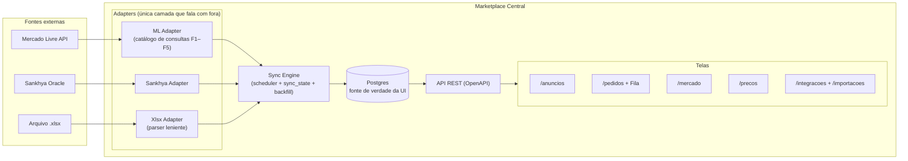
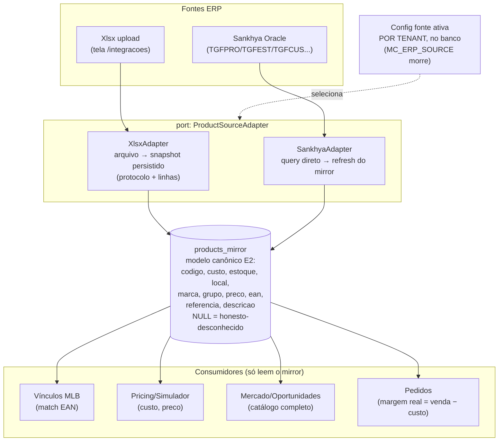
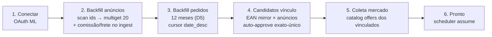
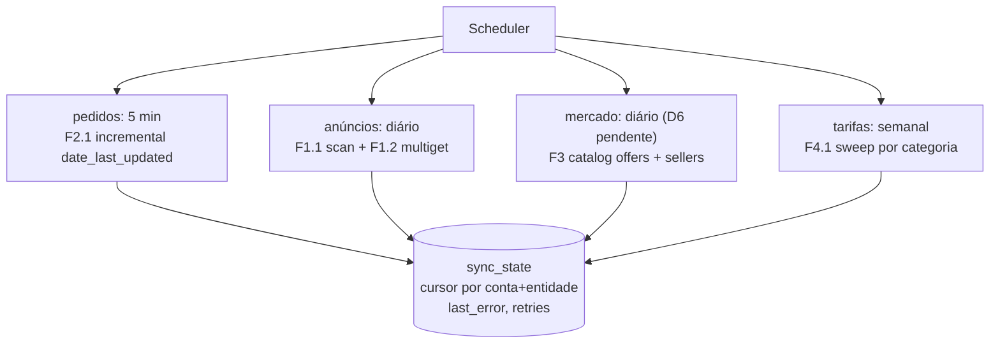
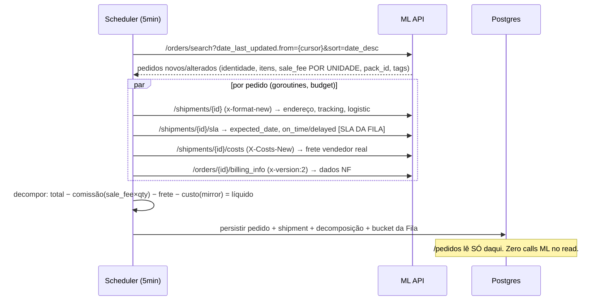
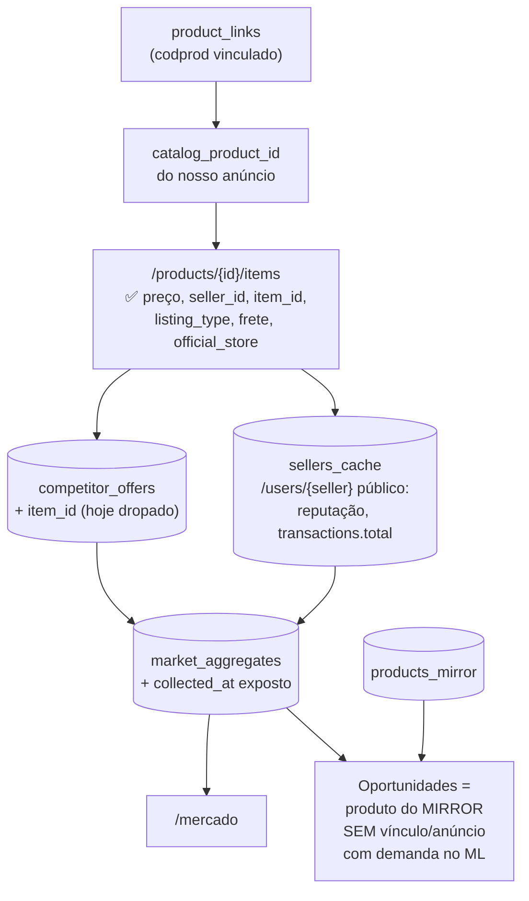

# System Blueprint — Arquitetura Alvo (D-120 replan)

Como o sistema inteiro funciona: cada processo desenhado, cada dado com origem, transporte e
tela. Base: [INTEGRATION-DATA-CONTRACT.md](INTEGRATION-DATA-CONTRACT.md) (contratos E1–E7),
[ML-API-QUERY-CATALOG.md](ML-API-QUERY-CATALOG.md) (consultas F1–F5 + veredictos live),
[STORAGE-SCHEMA.md](STORAGE-SCHEMA.md) (tabelas + joins).

**Regra de ouro (não negociável): tela NUNCA chama API externa. Tela lê Postgres. API externa
alimenta Postgres via ingest/scheduler. Enriquecimento acontece no INGEST, não no read.**

---

## 1. Visão macro

Três consequências práticas:
1. Lentidão morre: /pedidos hoje faz até 3 calls ML por pedido no read (~10s) → passa a ler
   colunas já persistidas (`order_shipments`).
2. "Pedidos de hoje somem" morre: scheduler incremental 5min com cursor `date_last_updated`
   + `sort=date_desc` (bug do default `date_asc` provado live T7).
3. Refresh um-a-um morre: backfill = scan ids + multiget 20 (T1 ratificado).

---

## 2. Módulo Produto canônico (BASE — implementação começa aqui)

xlsx e Sankhya são **equivalentes**: dois adapters do mesmo port, convergindo no mesmo modelo
canônico (contrato E2, 10 campos). Diferença é só estratégia de persistência por TIPO de fonte.

**Dados em cada etapa (xlsx):**

| Etapa | Entrada | Saída | Onde fica |
|---|---|---|---|
| 1. Upload | arquivo .xlsx | protocolo criado | `erp_import_protocols` |
| 2. Parse leniente | sheets brutas | linhas normalizadas E2 (aliases PT, preâmbulo, união multi-sheet) | `erp_import_products` (histórico por protocolo) |
| 3. Upsert-merge mirror | snapshot do protocolo | estado corrente por codigo_produto (upsert por codigo; ausente → stale, keep-absent, ADR-04) | `products_mirror` (+ stock_locations) |
| 4. Vínculos | mirror × listings (EAN) | candidatos; **EAN-exato-único = auto-aprovado + audit** (D4) | `product_links` + audit |
| 5. Coleta mercado | novos vínculos | jobs de coleta enfileirados | `sync_state` / fila |
| 6. Tela /importacoes | protocolo | cadeia visível: N importados → N vinculados → N coletas | leitura das tabelas acima |

**Sankhya:** mesmas etapas 3–6; etapas 1–2 viram "conexão testada + query agendada"
([TESTAR-SKW] mapeia colunas na sessão do especialista Oracle antes de implementar).
Os 4 elos quebrados de hoje ("xlsx nunca aparecia em Oportunidades" — contrato §1c) morrem
nas etapas 3, 4 e 5: dataset ativo por config, vínculo automático, coleta disparada.

---

## 3. Onboarding ML (saga — hoje: conectar conta = NADA acontece)

Cada etapa grava progresso em `sync_state` → tela de onboarding mostra barra real
(anúncios 34/34, pedidos 120/350...). Falha em qualquer etapa = retomável (cursor), nunca
recomeça do zero. Conta live provada: 34 anúncios = backfill segundos; arquitetura aguenta
milhares (scan 1000/batch, scroll_id 5min → coletar ids primeiro, hidratar depois).

---

## 4. Sync contínuo (scheduler-first, D2)

Webhooks = fase 2 (precisa URL pública; missed_feeds só guarda 2 dias — scheduler continua
como rede de segurança mesmo com webhook ativo).

---

## 5. Fluxo Pedidos — dado por etapa (ingest)

Multiget de shipments não existe (T5 live) → paralelismo com goroutines resolve.
`faturado_at` = nosso, só no DB (nunca escreve no ML). Fila filtra `bucket` indexado
(hoje: mostra tudo). Colunas novas: data, SLA (expected_date), status semáforo.

---

## 6. Fluxo Mercado/Concorrência — o que é possível (limites provados live)

**Limite duro provado (T8/F2):** `/items` de terceiro = 403 em toda variante →
"quantos venderam" por concorrente NÃO existe via API. Tela mostra: preço ✅, quantos
concorrentes ✅, quem são ✅ (nickname/reputação), volume = proxy `transactions.total`
do seller, rotulado como tal — nunca número inventado (ADR-17).

---

## 7. Telas — cada dado: de onde vem, quando atualiza

| Tela | Dado | Tabela | Atualizado por |
|---|---|---|---|
| /anuncios | título, preço, status, **data criação real**, sold_quantity, tags | `listings` (+colunas E3) | backfill + diário + refresh manual em lote |
| /anuncios | comissão, frete grátis | `listings` (ingest F4) | no ingest do anúncio |
| /pedidos | pedido, itens, comprador, NF | `orders_*` | scheduler 5min |
| /pedidos | comissão, **líquido, margem** | decomposição persistida | no ingest (motor deixa de ser nil) |
| /pedidos Fila | bucket pendente, **SLA on_time/delayed** | `orders.bucket` + `order_shipments.sla_*` | no ingest |
| /mercado | concorrentes, preços, quem é | `competitor_offers` + `sellers_cache` | coleta diária |
| /mercado | Oportunidades | `products_mirror` − `product_links` + `market_aggregates` | derivado (join) |
| /precos | custo, estoque | `products_mirror` | import xlsx / sync Sankhya |
| /precos | tarifa real | `ml_tariffs` | sweep semanal |
| /importacoes | cadeia protocolo→vínculos→coletas | `erp_import_*` + `product_links` + `sync_state` | no import |
| /integracoes | fonte ativa, status conexão, progresso onboarding | config tenant + `sync_state` | eventos |

---

## 8. Ordem de implementação

Fase 0 (fundação, pequena): `sync_state` + esqueleto scheduler + config fonte-ativa por tenant.
**Fase 1 (ERP/xlsx — o começo escolhido):** `products_mirror` + XlsxAdapter reestruturado sobre
o parser leniente existente + upsert-merge mirror (keep-absent, ADR-04) + cadeia vínculo automático + tela /importacoes com
a cadeia visível. Sankhya entra na mesma fase como segundo adapter do mesmo port ([TESTAR-SKW]
antes de codar). Fase 2: sync anúncios (colunas E3 + backfill scan/multiget). Fase 3: sync
pedidos + decomposição + Fila/SLA. Fase 4: mercado/concorrência + tarifas. Fase 5: onboarding
saga amarrando tudo. Cada fase = fluxo deste doc + contrato + fixture multi-página + live-drive.
