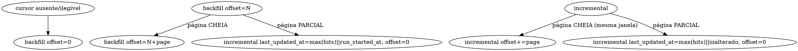

# F-00 — Scheduler periódico de pedidos (Implementation Plan)

> **For agentic workers:** REQUIRED SUB-SKILL: Use superpowers:subagent-driven-development (recommended) or superpowers:executing-plans to implement this plan task-by-task. Steps use checkbox (`- [ ]`) syntax for tracking.
>
> REQUIRED SUB-SKILL antes de alterar este plano: `mc-planning`. Ele foi escrito sob ela; a seção `## Medição` é o contrato de fatos deste plano.

**Goal:** Pedidos do Mercado Livre entram sozinhos, em janela incremental, com falha visível na tela do operador — sem ninguém clicar em "Importar".

**Architecture:** Registrar um `syncapp.JobFunc` em `domain.EntityOrders` num `syncapp.Scheduler` por instalação ML ativa, exatamente como `listings/composition` já faz para anúncios. Nada de ticker novo: reusar o scheduler compra reconciliação de `sync_state`, isolamento de falha por entidade, persistência de cursor e — o decisivo — `RecordFailure` alimentando o `SyncHealthCard`, que é entity-generic e portanto já sabe desenhar `orders` sem uma linha de contrato nova. Antes disso, alargar a cadeia de portas para carregar a janela `UpdatedAfter` que o adapter ML já sabe traduzir mas que três assinaturas intermediárias jogam fora.

**Tech Stack:** Go 1.x (`apps/server_core`), pgx/pgxpool, PostgreSQL, `syncapp.Scheduler`, adapter `connectors/adapters/mercado_livre`, React/TS em `apps/web` (somente leitura — nenhuma mudança).

---

## Medição

Tudo abaixo foi lido da árvore em 2026-08-03, tip `ae1a04d5`. Ancorado por conteúdo (nome de função, rota, constante), não por número de linha isolado.

### 1. O que já faz parte disto

| Fato | Onde |
|---|---|
| `EntityOrders Entity = "orders"` já é entidade válida e passa em `Valid()` | `sync/domain/sync_state.go` |
| `syncapp.Scheduler` já dá cursor persistido, `RecordSuccess`/`RecordFailure`, isolamento por entidade e `safeInvoke` (panic → falha daquela entidade) | `sync/application/scheduler.go` |
| Template de fan-out por instalação já existe e está em produção | `listings/composition/scheduler.go` → `resolveListingsSchedulers` |
| Template de scheduler intra-módulo | `sync/composition/products_job.go` → `NewProductsScheduler` |
| Caminho de escrita único de pedido já existe e é idempotente | `orders/application/ingest_service.go` → `IngestOrder`; upsert em `orders/adapters/postgres/order_repo.go:654` `ON CONFLICT (tenant_id, installation_id, provider_order_id) DO UPDATE` |
| Enumeração + ingest em lote já existe | `orders/application/import_service.go` → `ImportService.Import` |
| Adapter ML já traduz janela incremental | `connectors/adapters/mercado_livre/capability_adapter.go` → `ListOrders` seta `order.date_last_updated.from` quando `input.UpdatedAfter != nil` |

**Conclusão:** F-00 não constrói motor. Ele liga um motor que existe num relógio que existe. O que falta é a janela e a composição.

### 2. Onde o defeito é CAUSADO (não onde aparece)

`ListOrdersInput.UpdatedAfter *time.Time` existe em `connectors/domain/capability.go` e o adapter ML o consome. Mas **três assinaturas intermediárias estreitam para `(installationID string, limit int)`** e descartam a janela:

- `integrations/application/provider_operation_service.go` → `func (s *ProviderOperationService) ListOrders(ctx, installationID string, limit int)`
- `orders/ports/order_source.go` → `type OrderSource interface { ListOrders(ctx, installationID string, limit int) }`
- `orders/adapters/integrations/order_source.go` → `type ProviderOrderReader interface { ListOrders(ctx, installationID string, limit int) }`
- (+ o façade de composição `authFlowFacade.ListOrders` em `internal/composition/root.go:188`)

E `ImportOrdersInput{InstallationID, Limit}` não tem por onde receber janela nem offset.

Sem alargar isso, um job periódico só sabe pedir "os N mais recentes" toda vez — que é varredura cega, não incremental.

### 3. Quem mais consome esse caminho

`ordersImportSvc` é composto em `root.go:597` e consumido só por `orderstransport.NewHandlerWithSummary(...)` → rota `POST /orders/import`. `providerOperationSvc` é consumido em `root.go:417` (`authFlowFacade`), `root.go:427` (`productLinkImportSvc.Source`) e `root.go:598`. Alargar as assinaturas é mudança compilada, não silenciosa: o `tsc`/`go build` reprova todo sítio esquecido.

### 4. O que o contrato já diz

`GET /sync/health` já devolve `entities[]` construído por varredura de linhas (`sync/application/health_service.go`, `sync/transport/health_handler.go:83`) — **sem allowlist de entidade**. O front `apps/web/src/pages/integracoes/SyncHealthCard.tsx` rotula genericamente (`entityLabel`) com comentário explícito de que entidade desconhecida/futura tem que renderizar.

**Consequência:** registrar o job `orders` faz a saúde dele aparecer em `/integracoes` com **zero** mudança em `contracts/api/marketplace-central.openapi.yaml` e **zero** em `packages/sdk-runtime`. `GOV_API_SDK_SPLIT` não é acionado porque nenhum dos dois muda. Isso é força do desenho, não sorte — e é o argumento decisivo contra construir um ticker paralelo.

### 5. Estado vivo real

- `sync_state` tem linhas para `listings`, `market`, `products`. **Nenhuma para `orders`.**
- Uma instalação ML conectada: `inst-mercado_livre-7e0d2125-f525-4174-9ade-8c7dc496a0e0`.
- `orders_marketplace_orders`: 38 linhas; `max(fetched_at)` = 2026-08-02; `max(provider_updated_at)` = 2026-07-31.

Ou seja: pedido só entra quando alguém clica. É exatamente o buraco que F-00 fecha.

### 6. Orçamento de chamadas

`IngestOrder` faz até 3 chamadas ML por pedido (`GetOrderDetail`, `GetShipmentDetail` condicional, `GetBuyerFiscal`). `CapabilityAdapter.ListOrders` hoje faz **mais uma** por hit da busca (`ReadOrder` por resultado) cujo snapshot `ImportService` descarta menos o id → hoje um ciclo custa `1 + 4N`.

Bucket compartilhado: `defaultRateLimitPerMinute = 900` (54.000/hora).

| Cenário | Chamadas/ciclo | Chamadas/hora (ciclo de 15 min) |
|---|---|---|
| Hoje, cego, 50 pedidos | 1 + 4×50 = 201 | ~804 |
| F-00 com janela, ciclo quieto (0 pedidos novos) | 1 | 4 |
| F-00 com janela, 10 pedidos novos | 1 + 3×10 = 31 | ~124 |

A janela incremental é o que transforma custo constante em custo proporcional ao movimento real. É por isso que ela vem antes do scheduler, não depois.

### 7. O que prova quebrado / consertado

Quebrado hoje: `SELECT entity FROM sync_state WHERE installation_id = 'inst-mercado_livre-...'` não devolve `orders`, e a tela `/integracoes` não desenha linha de pedidos. Consertado: devolve, e a linha aparece verde após o primeiro ciclo — vermelha se o ciclo falhar.

### 8. O que quebra em silêncio às 3h da manhã

- **Token ML expirado** → `accessToken` falha → job retorna erro → `RecordFailure` → `consecutive_failures > 0` → `entityTone` = `"red"` na tela. Coberto pelo reuso do scheduler (e é a razão dele).
- **Cursor apagado**: `JobFunc` que retorna `nil` **apaga** o cursor (`sync/application/scheduler.go`). Todo caminho de erro deste job devolve o cursor recebido, sem alteração.
- **Página cheia tratada como janela drenada** → pedidos pulados para sempre. Tratado no desenho do cursor (§ Arquitetura do cursor) sem depender de ordenação do provider.
- **Restart antes do primeiro tick**: o `Start` do scheduler é ticker puro — não dispara no boot. Com 15 min é tolerável; fica registrado como D-16 (ver Task 9).

### 9. Governança

Baseline real da lane de governança (`npm run harness:governance -BaseSha 6bd22c29`) mediu, na main: **17 `GOV_MODULE_DEPENDENCY` + 9 `GOV_MODULE_LAYER`**. A main é **baseline vermelha conhecida** — a nota de `temporary_exceptions` em `contracts/governance/modules.json` (`module-edge-tenant-config-erp-import-adapter`) fala de "main tip baseline 55 violations… strict subset, zero new". O gate compara com o baseline; ele não exige zero.

Dois desses achados são de `listings`:
- `listings/application/backfill.go` importa `sync/application` — `listings.dependencies` não declara `sync` → `GOV_MODULE_DEPENDENCY`.
- `listings/composition/scheduler.go` importa `sync/adapters/postgres` → `GOV_MODULE_DEPENDENCY` + `GOV_MODULE_LAYER` (camada `adapters` é alvo proibido).

**Consequência direta para F-00:** copiar o padrão de `listings` verbatim adiciona as mesmas duas violações em `orders`. O plano evita isso expondo um construtor em `sync/composition` (camada permitida) e declarando a aresta `orders → sync` em `modules.json` — e de quebra fecha as de `listings`, entregando **subconjunto estrito**, não só "zero novas".


---

## Máximo local vs. máximo global

| Pergunta | Resposta medida |
|---|---|
| A correção mínima resolve o problema declarado? | Não. Um job que só pede "últimos N" é varredura cega: custo constante e cobertura não garantida. |
| A correção mínima deixa a mesma classe de defeito viva? | Sim — a janela continuaria descartada em 4 sítios, e o próximo consumidor repetiria a estreita. |
| A correção maior é maior por invenção ou por dívida acumulada? | Por dívida: `UpdatedAfter` já existe nas duas pontas (domínio e adapter ML). O meio é que foi estreitado. |
| O caminho global já existe em algum lugar do repo? | Sim: `sync/composition.NewProductsScheduler` é literalmente o construtor que `orders` precisa, só que privado ao caso ERP. |

**Decisão:** vai o global. O plano alarga a cadeia de portas (Slice A), extrai a enumeração id-only que já existe inline dentro de `CapabilityAdapter.ListOrders` (Slice A, Task 3), e roteia a composição por `sync/composition` em vez de importar `sync/adapters/postgres` (Slice B). Nada disso é invenção — é remoção de estreitamento.

**Fora de escopo, vira dívida nomeada** (Task 9): catch-up no boot (D-16), reconciliação de instalações conectadas após o boot, e migração de `listings/composition` para o novo construtor caso Task 6 não a inclua.

---

## Arquitetura do cursor

Vocabulário ADR-07: `backfill | incremental | sweep`. Só `incremental` avança `last_incremental_at` — e o scheduler decide isso lendo o campo `phase` do cursor (`inferIncremental`), então o campo tem que existir com esse nome.

```json
{ "phase": "incremental", "last_updated_at": "2026-08-03T11:00:00Z", "offset": 0,
  "run_started_at": "2026-08-03T09:00:00Z", "last_run_enumerated": 7,
  "last_run_imported": 7, "last_run_skipped": 0 }
```

Máquina de estados, **independente de ordenação do provider** (não sabemos se `/orders/search` ordena por `date_last_updated`, e o plano não aposta nisso):



Regras que não podem ser negociadas na implementação:

1. **Página cheia nunca avança `last_updated_at`.** Só avança offset. Uma página cheia significa "a janela ainda tem mais"; avançar a marca d'água aí pula pedidos silenciosamente.
2. **`last_updated_at` só recebe valor medido.** Se nenhum hit trouxe `date_last_updated`, o cursor **não avança** — não recebe `now()`. Uma janela que não sabe onde termina é reprocessada, não fabricada (ADR-17).
3. **Na virada de `backfill`→`incremental` sem nenhum `date_last_updated`**, usa-se `run_started_at`, que é um instante *medido* no início do backfill ("enumeramos tudo até aqui"), não um default plausível.
4. **Sobreposição (`overlap`)**: a consulta usa `UpdatedAfter = last_updated_at - overlap` (5 min) para sobreviver a skew de relógio. É seguro porque `IngestOrder` é upsert idempotente (`order_repo.go:654`) — Task 4 prova isso com teste de integração real, não por leitura.
5. **Todo caminho de erro devolve o cursor recebido**, nunca `nil` (que apagaria o estado).

---

## File Structure

| Arquivo | Responsabilidade | Ação |
|---|---|---|
| `apps/server_core/internal/modules/connectors/domain/capability.go` | `OrderSearchHit` (id + `date_last_updated` opcional) | Modificar |
| `apps/server_core/internal/modules/connectors/ports/marketplace_capability.go` | `OrderReader` ganha `ListOrderRefs` | Modificar (**seam compartilhado**) |
| `apps/server_core/internal/modules/connectors/adapters/mercado_livre/capability_adapter.go` | Enumeração id-only extraída; `ListOrders` passa a compor sobre ela | Modificar |
| `apps/server_core/internal/modules/integrations/application/provider_operation_service.go` | Deixa de estreitar a janela | Modificar |
| `apps/server_core/internal/modules/orders/ports/order_source.go` | `ListOrdersInput` com janela e offset | Modificar |
| `apps/server_core/internal/modules/orders/adapters/integrations/order_source.go` | Repassa janela; para de hidratar snapshot descartado | Modificar |
| `apps/server_core/internal/modules/orders/application/import_service.go` | Aceita janela/offset; devolve `EnumeratedCount` e `MaxProviderUpdatedAt` | Modificar |
| `apps/server_core/internal/modules/orders/domain/*` (`ImportResult`) | Campos novos de resultado | Modificar |
| `apps/server_core/internal/modules/orders/application/orders_job.go` | **A máquina de estados do cursor.** Única unidade nova de lógica | Criar |
| `apps/server_core/internal/modules/orders/application/orders_job_test.go` | Testes da máquina de estados (puros, sem rede, sem banco) | Criar |
| `apps/server_core/internal/modules/sync/composition/installation_scheduler.go` | `NewInstallationScheduler` — construtor reutilizável por instalação | Criar |
| `apps/server_core/internal/modules/orders/composition/scheduler.go` | Fan-out por instalação ML ativa | Criar |
| `apps/server_core/internal/modules/orders/composition/scheduler_test.go` | Fan-out testado com `installationLister` falso | Criar |
| `apps/server_core/internal/composition/root.go` | Uma chamada de composição + façade alargado | Modificar (**seam compartilhado**) |
| `contracts/governance/modules.json` | Arestas `orders → sync` e `listings → sync` | Modificar (**seam compartilhado**) |
| `.mnfs/HARNESS-DEBTS.md` | D-16 e vizinhas | Modificar |

**Contrato:** `contracts/api/marketplace-central.openapi.yaml` e `packages/sdk-runtime` **não mudam**. Se alguma task quiser mudá-los, ela saiu do plano — pare e reavalie.

---

## Slice A — a janela atravessa a cadeia

### Task 0: Registrar o baseline real de governança

**Files:**
- Ler: `scripts/harness/Policy.psm1`
- Modificar: este plano (§Medição.9), se a contagem divergir

- [ ] **Step 1: Rodar a lane de governança na main limpa**

```bash
npm run harness:governance
```

Esperado: a lane termina e imprime a lista de violações. Anote a contagem por regra (`GOV_MODULE_DEPENDENCY`, `GOV_MODULE_LAYER`) e o SHA medido.

- [ ] **Step 2: Comparar com §Medição.9**

Se os números baterem, escreva no relatório da task "baseline confirmado: D=11, L=9 @<sha>". Se não baterem, **corrija §Medição.9 neste arquivo** com os números reais e cite o output. Um plano que carrega número errado treina o leitor a ignorar o próximo.

- [ ] **Step 3: Commit (só se o plano mudou)**

```bash
git add docs/superpowers/plans/2026-08-03-f00-scheduler-pedidos-plan.md
git commit -m "plan(F-00): baseline de governanca medido na lane real"
```

---

### Task 1: `ListOrdersInput` de `orders` ganha janela e offset

**Files:**
- Modify: `apps/server_core/internal/modules/orders/ports/order_source.go`
- Modify: `apps/server_core/internal/modules/orders/adapters/integrations/order_source.go`
- Modify: `apps/server_core/internal/modules/orders/application/import_service.go`
- Modify: `apps/server_core/internal/modules/orders/domain/` (arquivo que define `ImportResult`)
- Test: `apps/server_core/internal/modules/orders/application/import_service_test.go`

- [ ] **Step 1: Escrever o teste que falha**

Adicione em `import_service_test.go`. O fake de `OrderSource` aqui é legítimo: `OrderSource` é uma porta de *domínio da aplicação*, e o que se testa é o repasse de parâmetro — não integração com provider.

```go
func TestImportPassesWindowAndOffsetToSource(t *testing.T) {
	updatedAfter := time.Date(2026, 8, 1, 12, 0, 0, 0, time.UTC)
	src := &recordingSource{}
	svc := application.NewImportService(application.ImportServiceConfig{
		Source:   src,
		Ingestor: noopIngestor{},
	})

	_, err := svc.Import(context.Background(), application.ImportOrdersInput{
		InstallationID: "inst-1",
		Limit:          50,
		Offset:         100,
		UpdatedAfter:   &updatedAfter,
	})
	if err != nil {
		t.Fatalf("import: %v", err)
	}
	if src.got.Offset != 100 {
		t.Fatalf("offset: quero 100, recebi %d", src.got.Offset)
	}
	if src.got.UpdatedAfter == nil || !src.got.UpdatedAfter.Equal(updatedAfter) {
		t.Fatalf("updated_after: quero %s, recebi %v", updatedAfter, src.got.UpdatedAfter)
	}
}

type recordingSource struct{ got ports.ListOrdersInput }

func (s *recordingSource) ListOrders(_ context.Context, in ports.ListOrdersInput) ([]domain.OrderIngestionSnapshot, error) {
	s.got = in
	return nil, nil
}
```

- [ ] **Step 2: Rodar e ver falhar**

```bash
cd apps/server_core && GOCACHE="$PWD/.gocache" go test ./internal/modules/orders/application/ -run TestImportPassesWindowAndOffsetToSource -v
```

Esperado: FAIL na compilação — `ports.ListOrdersInput` não existe e `application.ImportOrdersInput` não tem `Offset`/`UpdatedAfter`. Essa é a falha correta: o critério é infalsificável enquanto o tipo não declarar os campos.

- [ ] **Step 3: Alargar a porta**

`apps/server_core/internal/modules/orders/ports/order_source.go`:

```go
package ports

import (
	"context"
	"time"

	"marketplace-central/apps/server_core/internal/modules/orders/domain"
)

// ListOrdersInput é a janela de enumeração. Ela existe como struct — e não como
// mais dois parâmetros posicionais — porque a assinatura estreita
// (installationID, limit) já custou uma feature: o adapter Mercado Livre sabe
// traduzir UpdatedAfter para order.date_last_updated.from desde sempre, e três
// camadas intermediárias jogavam o valor fora antes de chegar nele.
type ListOrdersInput struct {
	InstallationID string
	Limit          int
	Offset         int
	// UpdatedAfter nil significa "sem janela" (varredura), não "desde a época
	// zero". Os dois produzem consultas diferentes no provider.
	UpdatedAfter *time.Time
}

type OrderSource interface {
	ListOrders(ctx context.Context, input ListOrdersInput) ([]domain.OrderIngestionSnapshot, error)
}
```

- [ ] **Step 4: Alargar o adapter de `orders`**

`apps/server_core/internal/modules/orders/adapters/integrations/order_source.go` — trocar a interface e a assinatura, mantendo o mapeamento de campos exatamente como está:

```go
type ProviderOrderReader interface {
	ListOrders(ctx context.Context, input connectorsdomain.ListOrdersInput, installationID string) ([]connectorsdomain.OrderSnapshot, error)
}

func (s OrderSource) ListOrders(ctx context.Context, input ordersports.ListOrdersInput) ([]ordersdomain.OrderIngestionSnapshot, error) {
	snapshots, err := s.reader.ListOrders(ctx, connectorsdomain.ListOrdersInput{
		Cursor:       strconv.Itoa(input.Offset),
		Limit:        input.Limit,
		UpdatedAfter: input.UpdatedAfter,
	}, input.InstallationID)
	if err != nil {
		return nil, err
	}
	// ... mapeamento de campos INALTERADO ...
}
```

> `AccountRef` continua sendo resolvido pelo `ProviderOperationService` a partir do `installationID` (é o que ele já faz hoje) — por isso ele viaja como parâmetro separado, e não dentro do `ListOrdersInput` de `connectors`.

- [ ] **Step 5: Alargar `ImportService`**

Em `import_service.go`, trocar o input e repassar. **Nada mais muda** — o laço de ingest, o `SkippedCount`, o log e a política "um pedido falho não aborta o lote" ficam idênticos.

```go
type ImportOrdersInput struct {
	InstallationID string
	Limit          int
	Offset         int
	UpdatedAfter   *time.Time
}
```

```go
	snapshots, err := s.source.ListOrders(ctx, ports.ListOrdersInput{
		InstallationID: installationID,
		Limit:          limit,
		Offset:         input.Offset,
		UpdatedAfter:   input.UpdatedAfter,
	})
```

- [ ] **Step 6: `ImportResult` devolve o que o cursor precisa**

No arquivo de `orders/domain` que define `ImportResult`, adicionar:

```go
	// EnumeratedCount é quantos ids a enumeração devolveu — distinto de
	// ImportedCount+SkippedCount porque ids vazios são descartados antes do
	// ingest. É EnumeratedCount que diz se a página veio cheia, e portanto se a
	// janela foi drenada.
	EnumeratedCount int
	// MaxProviderUpdatedAt é o maior date_last_updated visto na enumeração, ou
	// nil se nenhum hit trouxe o campo. nil significa desconhecido — nunca a
	// época zero, nunca now() (ADR-17).
	MaxProviderUpdatedAt *time.Time
```

E preencher em `Import`: incrementar `EnumeratedCount` por snapshot enumerado, e acumular o máximo de `snapshot.ProviderUpdatedAt` ignorando o valor zero.

- [ ] **Step 7: Verificar que o DTO de transporte NÃO mudou**

```bash
cd apps/server_core && grep -n "ImportedCount\|SkippedCount\|EnumeratedCount\|MaxProviderUpdatedAt" internal/modules/orders/transport/http_handler.go
```

Esperado: nenhuma ocorrência de `EnumeratedCount` nem `MaxProviderUpdatedAt`. Se o handler serializar `domain.ImportResult` diretamente em vez de mapear campo a campo, **pare**: isso mudaria o corpo de resposta de `POST /orders/import` e acionaria `GOV_API_SDK_SPLIT`. Nesse caso, introduza um DTO explícito no handler com exatamente os campos de hoje, e registre isso no relatório da task.

- [ ] **Step 8: Rodar o teste e ver passar**

```bash
cd apps/server_core && GOCACHE="$PWD/.gocache" go test ./internal/modules/orders/... -v
```

Esperado: PASS, incluindo `TestImportPassesWindowAndOffsetToSource`.

- [ ] **Step 9: Commit**

```bash
git add apps/server_core/internal/modules/orders
git commit -m "refactor(orders): janela de atualizacao atravessa a porta de enumeracao"
```

---

### Task 2: `ProviderOperationService` para de estreitar a janela

**Files:**
- Modify: `apps/server_core/internal/modules/integrations/application/provider_operation_service.go`
- Modify: `apps/server_core/internal/composition/root.go` (`authFlowFacade.ListOrders`)
- Test: `apps/server_core/internal/modules/integrations/application/provider_operation_service_test.go`

- [ ] **Step 1: Escrever o teste que falha**

```go
func TestListOrdersForwardsWindowToCapability(t *testing.T) {
	updatedAfter := time.Date(2026, 8, 1, 12, 0, 0, 0, time.UTC)
	reader := &capturingReader{}
	svc := newServiceWithReader(t, reader) // helper já existente no pacote de teste

	_, err := svc.ListOrders(context.Background(), connectorsdomain.ListOrdersInput{
		Limit:        50,
		Cursor:       "100",
		UpdatedAfter: &updatedAfter,
	}, "inst-1")
	if err != nil {
		t.Fatalf("list orders: %v", err)
	}
	if reader.got.Cursor != "100" {
		t.Fatalf("cursor: quero \"100\", recebi %q", reader.got.Cursor)
	}
	if reader.got.UpdatedAfter == nil || !reader.got.UpdatedAfter.Equal(updatedAfter) {
		t.Fatalf("updated_after: quero %s, recebi %v", updatedAfter, reader.got.UpdatedAfter)
	}
	if reader.got.AccountRef.ProviderAccountID == "" {
		t.Fatalf("account ref: o service ainda tem que resolver a conta a partir da instalacao")
	}
}
```

A última asserção é o controle negativo desta task: ela impede que "alargar a assinatura" vire "delegar ao chamador a resolução de conta", que é justamente o que o service existe para fazer.

- [ ] **Step 2: Rodar e ver falhar**

```bash
cd apps/server_core && GOCACHE="$PWD/.gocache" go test ./internal/modules/integrations/application/ -run TestListOrdersForwardsWindowToCapability -v
```

Esperado: FAIL de compilação — assinatura antiga.

- [ ] **Step 3: Trocar a assinatura**

```go
// ListOrders enumera pedidos da instalação. O input do provider chega inteiro:
// o service resolve a conta (AccountRef) e não toca em mais nada, para que uma
// capacidade nova do provider (janela, status, ordenação) não exija outra
// mudança de assinatura aqui.
func (s *ProviderOperationService) ListOrders(ctx context.Context, input connectorsdomain.ListOrdersInput, installationID string) ([]connectorsdomain.OrderSnapshot, error) {
	inst, reader, err := s.resolveOrderReader(ctx, installationID) // extraia do corpo atual
	if err != nil {
		return nil, err
	}
	input.AccountRef = s.accountRef(inst)
	return reader.ListOrders(ctx, input)
}
```

- [ ] **Step 4: Atualizar o façade de composição**

`internal/composition/root.go` — `authFlowFacade.ListOrders` passa a repassar o input inteiro. Se o consumidor daquele façade (`productLinkImportSvc.Source`) só precisa de `limit`, ele constrói o input com `Limit` preenchido e `UpdatedAfter` nil — nil significa "sem janela", que é o comportamento de hoje, preservado explicitamente.

- [ ] **Step 5: Compilar tudo**

```bash
cd apps/server_core && GOCACHE="$PWD/.gocache" go build ./... && GOCACHE="$PWD/.gocache" go vet ./...
```

Esperado: sem erro. Qualquer sítio esquecido aparece aqui — o compilador é o instrumento de varredura desta task, e é total.

- [ ] **Step 6: Rodar a unit lane inteira**

```bash
npm run harness:unit
```

Esperado: PASS.

- [ ] **Step 7: Commit**

```bash
git add apps/server_core/internal/modules/integrations apps/server_core/internal/composition/root.go
git commit -m "refactor(integrations): ListOrders repassa o input do provider inteiro"
```

---

### Task 3: Enumeração id-only — parar de hidratar o que é descartado

**Files:**
- Modify: `apps/server_core/internal/modules/connectors/domain/capability.go`
- Modify: `apps/server_core/internal/modules/connectors/ports/marketplace_capability.go` (**seam compartilhado: provider-capability-contract**)
- Modify: `apps/server_core/internal/modules/connectors/adapters/mercado_livre/capability_adapter.go`
- Modify: `apps/server_core/internal/modules/orders/adapters/integrations/order_source.go`
- Test: `apps/server_core/internal/modules/connectors/adapters/mercado_livre/capability_adapter_test.go`

> **Adjudicação do seam.** `ports.OrderReader` é contrato de capacidade de provider. Antes de editar, rode:
> ```bash
> git worktree list && git diff --name-only main...HEAD
> ```
> e confirme que nenhum outro checkout tem esse arquivo aberto. Depois enumere os implementadores:
> ```bash
> cd apps/server_core && grep -rn "ListOrders(ctx context.Context, input" --include=*.go .
> ```
> Medido em 2026-08-03: **um** implementador de produção (`mercado_livre.CapabilityAdapter`). Fakes de teste também implementam a interface e vão quebrar na compilação — isso é desejado e é como se descobre o conjunto real.

- [ ] **Step 1: Escrever o teste que falha**

Contra um `httptest.Server` que serve `/orders/search` e **falha o teste se `/orders/{id}` for chamado**. Esse é o controle negativo: hoje o adapter chama `ReadOrder` por hit, então o teste tem que reprovar antes da mudança.

```go
func TestListOrderRefsDoesNotHydrateEachOrder(t *testing.T) {
	var readOrderCalls int32
	srv := httptest.NewServer(http.HandlerFunc(func(w http.ResponseWriter, r *http.Request) {
		switch {
		case strings.HasPrefix(r.URL.Path, "/orders/search"):
			w.Header().Set("Content-Type", "application/json")
			_, _ = io.WriteString(w, `{"results":[
				{"id":2000000000001,"date_last_updated":"2026-08-02T10:00:00.000-03:00"},
				{"id":2000000000002,"date_last_updated":"2026-08-02T11:00:00.000-03:00"}]}`)
		default:
			atomic.AddInt32(&readOrderCalls, 1)
			w.WriteHeader(http.StatusInternalServerError)
		}
	}))
	defer srv.Close()

	adapter := newTestAdapter(t, srv.URL) // helper já existente no pacote
	refs, err := adapter.ListOrderRefs(context.Background(), domain.ListOrdersInput{
		AccountRef: testAccountRef, Limit: 50,
	})
	if err != nil {
		t.Fatalf("list order refs: %v", err)
	}
	if got := atomic.LoadInt32(&readOrderCalls); got != 0 {
		t.Fatalf("enumeracao id-only chamou /orders/{id} %d vez(es); quero 0", got)
	}
	if len(refs) != 2 {
		t.Fatalf("refs: quero 2, recebi %d", len(refs))
	}
	if refs[0].ProviderOrderID != "2000000000001" {
		t.Fatalf("id: quero \"2000000000001\", recebi %q", refs[0].ProviderOrderID)
	}
	if refs[0].ProviderUpdatedAt == nil {
		t.Fatalf("date_last_updated presente no payload tem que chegar no ref")
	}
	if !refs[0].ProviderUpdatedAt.Equal(time.Date(2026, 8, 2, 13, 0, 0, 0, time.UTC)) {
		t.Fatalf("date_last_updated: quero 13:00Z (10:00-03:00), recebi %s", refs[0].ProviderUpdatedAt)
	}
}
```

O offset de fuso na última asserção não é decoração: é o que distingue "parseou" de "parseou certo".

- [ ] **Step 2: Escrever o teste do desconhecido**

```go
func TestListOrderRefsLeavesUpdatedAtNilWhenProviderOmitsIt(t *testing.T) {
	// payload: {"results":[{"id":2000000000003}]}
	// Esperado: refs[0].ProviderUpdatedAt == nil.
	// Ausência do campo é DESCONHECIDO. Zero time seria uma data de 1º de janeiro
	// do ano 1 entrando numa marca d'água de cursor (ADR-17).
}
```

- [ ] **Step 3: Rodar e ver falhar**

```bash
cd apps/server_core && GOCACHE="$PWD/.gocache" go test ./internal/modules/connectors/adapters/mercado_livre/ -run TestListOrderRefs -v
```

Esperado: FAIL de compilação — `ListOrderRefs` não existe.

- [ ] **Step 4: Adicionar o tipo de domínio**

`connectors/domain/capability.go`:

```go
// OrderSearchHit é o que /orders/search devolve por resultado antes de qualquer
// hidratação: a identidade e, quando o provider informa, quando o pedido mudou
// pela última vez. ProviderUpdatedAt é ponteiro porque ausente e "muito antigo"
// são estados diferentes, e um cursor que confunde os dois pula pedidos.
type OrderSearchHit struct {
	ProviderOrderID   string
	ProviderUpdatedAt *time.Time
}
```

- [ ] **Step 5: Alargar a porta de capacidade**

`connectors/ports/marketplace_capability.go`:

```go
type OrderReader interface {
	// ListOrderRefs enumera identidades sem hidratar cada pedido. Existe
	// separado de ListOrders porque o consumidor em lote (orders.ImportService)
	// descarta tudo do snapshot exceto o id e chama o caminho de escrita único
	// (IngestOrder), que refaz a leitura completa — ou seja, a hidratação da
	// enumeração era uma chamada de provider por pedido, por ciclo, jogada fora.
	ListOrderRefs(ctx context.Context, input domain.ListOrdersInput) ([]domain.OrderSearchHit, error)
	ListOrders(ctx context.Context, input domain.ListOrdersInput) ([]domain.OrderSnapshot, error)
	ReadOrder(ctx context.Context, ref domain.ProviderOrderRef) (domain.OrderSnapshot, error)
}
```

- [ ] **Step 6: Implementar no adapter ML e recompor `ListOrders` sobre ele**

Extraia o corpo atual de `ListOrders` até a decodificação da busca. `ListOrders` fica compondo — o comportamento dele não muda, então nenhum teste existente dele deve mudar.

```go
func (a *CapabilityAdapter) ListOrderRefs(ctx context.Context, input domain.ListOrdersInput) ([]domain.OrderSearchHit, error) {
	accountRef, err := normalizeAccountRef(input.AccountRef)
	if err != nil {
		return nil, err
	}
	token, err := a.accessToken(ctx, accountRef)
	if err != nil {
		return nil, err
	}

	query := url.Values{}
	query.Set("seller", accountRef.ProviderAccountID)
	query.Set("limit", strconv.Itoa(limitOrDefault(input.Limit, 50)))
	query.Set("offset", strconv.Itoa(offsetFromCursor(input.Cursor)))
	if status := strings.TrimSpace(input.Status); status != "" {
		query.Set("order.status", status)
	}
	if input.UpdatedAfter != nil {
		query.Set("order.date_last_updated.from", input.UpdatedAfter.UTC().Format(time.RFC3339))
	}

	var response struct {
		Results []struct {
			ID              any    `json:"id"`
			DateLastUpdated string `json:"date_last_updated"`
		} `json:"results"`
	}
	if err := a.doJSON(ctx, accountRef, token, http.MethodGet, "/orders/search?"+query.Encode(), nil, &response); err != nil {
		return nil, err
	}

	hits := make([]domain.OrderSearchHit, 0, len(response.Results))
	for _, result := range response.Results {
		orderID := normalizeAnyID(result.ID)
		if orderID == "" {
			continue
		}
		hit := domain.OrderSearchHit{ProviderOrderID: orderID}
		// Campo ausente ou ilegível fica nil: o consumidor sabe lidar com
		// "desconhecido", e não sabe lidar com uma data inventada.
		if raw := strings.TrimSpace(result.DateLastUpdated); raw != "" {
			if parsed, err := time.Parse(time.RFC3339, raw); err == nil {
				utc := parsed.UTC()
				hit.ProviderUpdatedAt = &utc
			}
		}
		hits = append(hits, hit)
	}
	return hits, nil
}

func (a *CapabilityAdapter) ListOrders(ctx context.Context, input domain.ListOrdersInput) ([]domain.OrderSnapshot, error) {
	hits, err := a.ListOrderRefs(ctx, input)
	if err != nil {
		return nil, err
	}
	accountRef, err := normalizeAccountRef(input.AccountRef)
	if err != nil {
		return nil, err
	}
	snapshots := make([]domain.OrderSnapshot, 0, len(hits))
	for _, hit := range hits {
		snapshot, err := a.ReadOrder(ctx, domain.ProviderOrderRef{
			AccountRef:      accountRef,
			ProviderOrderID: hit.ProviderOrderID,
		})
		if err != nil {
			return nil, err
		}
		snapshots = append(snapshots, snapshot)
	}
	return snapshots, nil
}
```

- [ ] **Step 7: Ligar `orders` ao caminho id-only**

`orders/ports/order_source.go` — o `OrderSource` de `orders` passa a devolver identidades, não snapshots, porque é só isso que `ImportService` usa:

```go
// OrderRef é o resultado da enumeração no vocabulário de orders.
type OrderRef struct {
	ProviderOrderID   string
	ProviderUpdatedAt *time.Time
}

type OrderSource interface {
	ListOrders(ctx context.Context, input ListOrdersInput) ([]OrderRef, error)
}
```

Ajuste `orders/adapters/integrations/order_source.go` para chamar `ListOrderRefs` e mapear — **todo o bloco de mapeamento de itens/pagamentos some**, porque ninguém o consumia. E ajuste `ImportService.Import` para iterar `[]ports.OrderRef` (o corpo do laço é idêntico: trim do id, `IngestOrder`, contagem).

- [ ] **Step 8: Rodar e ver passar**

```bash
cd apps/server_core && GOCACHE="$PWD/.gocache" go test ./internal/modules/connectors/... ./internal/modules/orders/... ./internal/modules/integrations/... -v
```

Esperado: PASS, incluindo os dois testes novos. Se algum fake de teste em outro pacote quebrou na compilação, implemente `ListOrderRefs` nele devolvendo o que aquele teste já declara — não invente comportamento novo em fake alheio.

- [ ] **Step 9: Commit**

```bash
git add apps/server_core/internal/modules
git commit -m "perf(connectors): enumeracao de pedidos sem hidratar cada um"
```

---

## Slice B — o job periódico

### Task 4: Provar a idempotência de que o cursor depende

**Files:**
- Test: `apps/server_core/tests/integration/orders_reingest_test.go` (criar)

> A regra 4 do cursor (sobreposição de 5 min) só é segura se reingerir o mesmo pedido não duplica linha. `order_repo.go:654` **diz** que é upsert. Este teste **prova** contra Postgres real — a lane hermética, não um fake.

- [ ] **Step 1: Escrever o teste**

Arquivo com `//go:build integration` nas 5 primeiras linhas, dentro de `./tests/integration`, conforme a lane exige.

```go
//go:build integration

package integration

// TestReingestSameOrderKeepsOneRow ingere o mesmo provider_order_id duas vezes
// contra Postgres real e conta as linhas. É o pré-requisito da janela com
// sobreposição do scheduler de pedidos: sem upsert, a sobreposição de 5 minutos
// duplicaria pedidos toda hora.
func TestReingestSameOrderKeepsOneRow(t *testing.T) {
	// 1. Subir o schema com as migrations (helper existente da lane).
	// 2. Inserir o pedido via o MESMO caminho de escrita da produção
	//    (orders/adapters/postgres OrderRepository.Save...), com um
	//    provider_order_id fixo.
	// 3. Repetir a escrita com um campo alterado (ex.: provider_status).
	// 4. Assertar:
	//    - COUNT(*) WHERE provider_order_id = ... AND tenant_id = ... == 1
	//    - o provider_status lido é o da SEGUNDA escrita (asserção de valor,
	//      não de presença: um upsert que ignora o conflito também deixaria
	//      COUNT == 1, e estaria errado).
}
```

A segunda asserção é o que separa `DO UPDATE` de `DO NOTHING`. Sem ela o teste passa nos dois mundos.

- [ ] **Step 2: Rodar e observar o vermelho nomeado**

```bash
npm run harness:integration
```

Antes de acreditar num verde: confirme que a saída nomeia este teste. Um teste que não roda e um teste que passa são byte-idênticos no relatório. Se a lane não citar `TestReingestSameOrderKeepsOneRow`, ele não executou.

Se o teste passar de primeira, injete o defeito para provar o controle: troque `DO UPDATE` por `DO NOTHING` numa cópia local e confirme que a segunda asserção reprova. Reverta.

- [ ] **Step 3: Commit**

```bash
git add apps/server_core/tests/integration/orders_reingest_test.go
git commit -m "test(orders): reingest do mesmo pedido nao duplica linha"
```

---

### Task 5: A máquina de estados do cursor

**Files:**
- Create: `apps/server_core/internal/modules/orders/application/orders_job.go`
- Create: `apps/server_core/internal/modules/orders/application/orders_job_test.go`

- [ ] **Step 1: Escrever os testes que falham**

Cinco casos, todos puros — sem rede, sem banco. O `OrdersImporter` falso aqui é legítimo: o que se testa é a decisão do cursor, e o importador real já tem cobertura própria.

```go
package application_test

type fakeImporter struct {
	calls   []application.ImportOrdersInput
	results []domain.ImportResult
	errs    []error
}

func (f *fakeImporter) Import(_ context.Context, in application.ImportOrdersInput) (domain.ImportResult, error) {
	f.calls = append(f.calls, in)
	i := len(f.calls) - 1
	var err error
	if i < len(f.errs) {
		err = f.errs[i]
	}
	var res domain.ImportResult
	if i < len(f.results) {
		res = f.results[i]
	}
	return res, err
}

// 1. Cursor ausente entra em backfill SEM janela.
func TestOrdersJobStartsInBackfillWithoutWindow(t *testing.T) {
	imp := &fakeImporter{results: []domain.ImportResult{{EnumeratedCount: 0}}}
	job := application.NewOrdersJob(imp, "inst-1", 50, 5*time.Minute, fixedNow)

	raw, err := job(context.Background(), nil)
	if err != nil {
		t.Fatalf("job: %v", err)
	}
	if imp.calls[0].UpdatedAfter != nil {
		t.Fatalf("backfill nao pode ter janela; recebi %v", imp.calls[0].UpdatedAfter)
	}
	var c application.OrdersCursor
	mustUnmarshal(t, raw, &c)
	if c.Phase != "incremental" {
		t.Fatalf("pagina parcial (0 de 50) drena a janela e vira incremental; phase=%q", c.Phase)
	}
	if c.LastUpdatedAt == nil || !c.LastUpdatedAt.Equal(fixedNow()) {
		t.Fatalf("sem date_last_updated nenhum, a marca d'agua e o run_started_at MEDIDO; recebi %v", c.LastUpdatedAt)
	}
}

// 2. Página cheia NÃO avança a marca d'água — só o offset.
func TestOrdersJobFullPageAdvancesOffsetNotWatermark(t *testing.T) {
	previous := time.Date(2026, 8, 1, 0, 0, 0, 0, time.UTC)
	newer := time.Date(2026, 8, 3, 0, 0, 0, 0, time.UTC)
	imp := &fakeImporter{results: []domain.ImportResult{{
		EnumeratedCount: 50, ImportedCount: 50, MaxProviderUpdatedAt: &newer,
	}}}
	job := application.NewOrdersJob(imp, "inst-1", 50, 5*time.Minute, fixedNow)

	raw, err := job(context.Background(), cursorJSON(t, "incremental", &previous, 0))
	if err != nil {
		t.Fatalf("job: %v", err)
	}
	var c application.OrdersCursor
	mustUnmarshal(t, raw, &c)
	if !c.LastUpdatedAt.Equal(previous) {
		t.Fatalf("pagina cheia significa janela NAO drenada; avancar a marca pula pedidos. quero %s, recebi %s", previous, c.LastUpdatedAt)
	}
	if c.Offset != 50 {
		t.Fatalf("offset: quero 50, recebi %d", c.Offset)
	}
}

// 3. Página parcial avança a marca d'água e zera o offset.
func TestOrdersJobPartialPageAdvancesWatermarkAndResetsOffset(t *testing.T) { /* espelho do 2, EnumeratedCount: 7 → LastUpdatedAt == newer, Offset == 0 */ }

// 4. Nenhum date_last_updated em fase incremental NÃO move a marca d'água.
func TestOrdersJobKeepsWatermarkWhenProviderOmitsUpdatedAt(t *testing.T) {
	previous := time.Date(2026, 8, 1, 0, 0, 0, 0, time.UTC)
	imp := &fakeImporter{results: []domain.ImportResult{{
		EnumeratedCount: 3, ImportedCount: 3, MaxProviderUpdatedAt: nil,
	}}}
	job := application.NewOrdersJob(imp, "inst-1", 50, 5*time.Minute, fixedNow)

	raw, err := job(context.Background(), cursorJSON(t, "incremental", &previous, 0))
	if err != nil {
		t.Fatalf("job: %v", err)
	}
	var c application.OrdersCursor
	mustUnmarshal(t, raw, &c)
	if !c.LastUpdatedAt.Equal(previous) {
		t.Fatalf("desconhecido nao vira now(): quero a marca anterior %s, recebi %s", previous, c.LastUpdatedAt)
	}
}

// 5. Erro do importador devolve o cursor RECEBIDO, byte a byte.
func TestOrdersJobErrorReturnsCursorUnchanged(t *testing.T) {
	in := cursorJSON(t, "incremental", ptr(time.Date(2026, 8, 1, 0, 0, 0, 0, time.UTC)), 100)
	imp := &fakeImporter{errs: []error{errors.New("token expirado")}}
	job := application.NewOrdersJob(imp, "inst-1", 50, 5*time.Minute, fixedNow)

	out, err := job(context.Background(), in)
	if err == nil {
		t.Fatalf("falha do provider tem que virar erro do ciclo — e' o que pinta a tela de vermelho")
	}
	if !bytes.Equal(out, in) {
		t.Fatalf("cursor no erro: devolver nil APAGA o estado. quero %s, recebi %s", in, out)
	}
}
```

- [ ] **Step 2: Rodar e ver falhar**

```bash
cd apps/server_core && GOCACHE="$PWD/.gocache" go test ./internal/modules/orders/application/ -run TestOrdersJob -v
```

Esperado: FAIL de compilação — `NewOrdersJob` e `OrdersCursor` não existem.

- [ ] **Step 3: Implementar**

```go
package application

import (
	"context"
	"encoding/json"
	"time"

	"marketplace-central/apps/server_core/internal/modules/orders/domain"
	syncapp "marketplace-central/apps/server_core/internal/modules/sync/application"
)

// OrdersCursor é o estado persistido em sync_state.cursor para a entidade
// orders. O campo Phase usa o vocabulário do ADR-07 (backfill|incremental|sweep)
// porque o scheduler lê exatamente esse campo para decidir se o ciclo avança
// last_incremental_at.
type OrdersCursor struct {
	Phase             string     `json:"phase"`
	LastUpdatedAt     *time.Time `json:"last_updated_at,omitempty"`
	Offset            int        `json:"offset"`
	RunStartedAt      *time.Time `json:"run_started_at,omitempty"`
	LastRunEnumerated int        `json:"last_run_enumerated"`
	LastRunImported   int        `json:"last_run_imported"`
	LastRunSkipped    int        `json:"last_run_skipped"`
}

const (
	phaseBackfill    = "backfill"
	phaseIncremental = "incremental"
)

// OrdersImporter é o pedaço de ImportService que o job consome. Declarado aqui
// (e não no pacote do consumidor) porque o job é quem define o contrato de que
// precisa.
type OrdersImporter interface {
	Import(ctx context.Context, input ImportOrdersInput) (domain.ImportResult, error)
}

// NewOrdersJob devolve o corpo de sync para a entidade orders.
//
// Duas invariantes valem mais que qualquer otimização aqui:
//
//  1. Página cheia não avança a marca d'água. Uma página cheia diz "a janela
//     ainda tem mais"; avançar a marca aí pula pedidos em silêncio, e o
//     silêncio é o defeito caro — a tela continuaria verde.
//  2. Marca d'água só recebe instante MEDIDO. Provider sem date_last_updated é
//     desconhecido; desconhecido não vira now() nem época zero (ADR-17). O
//     custo de não avançar é reprocessar uma janela, e reprocessar é barato
//     porque o ingest é upsert idempotente (provado em
//     tests/integration/orders_reingest_test.go).
//
// A sobreposição (overlap) recua a janela para sobreviver a skew de relógio
// entre nós e o provider, pelo mesmo motivo: reprocessar é barato, perder não é.
func NewOrdersJob(importer OrdersImporter, installationID string, pageSize int, overlap time.Duration, now func() time.Time) syncapp.JobFunc {
	if now == nil {
		now = func() time.Time { return time.Now().UTC() }
	}
	if pageSize <= 0 {
		pageSize = 50
	}
	return func(ctx context.Context, raw json.RawMessage) (json.RawMessage, error) {
		cursor := parseOrdersCursor(raw, now)

		input := ImportOrdersInput{
			InstallationID: installationID,
			Limit:          pageSize,
			Offset:         cursor.Offset,
		}
		if cursor.Phase == phaseIncremental && cursor.LastUpdatedAt != nil {
			from := cursor.LastUpdatedAt.Add(-overlap)
			input.UpdatedAfter = &from
		}

		result, err := importer.Import(ctx, input)
		if err != nil {
			// Cursor de volta INALTERADO: nil apagaria o estado, e uma marca
			// d'água apagada faz o próximo ciclo varrer tudo de novo achando
			// que é a primeira vez.
			return raw, err
		}

		next := cursor
		next.LastRunEnumerated = result.EnumeratedCount
		next.LastRunImported = result.ImportedCount
		next.LastRunSkipped = result.SkippedCount

		if result.EnumeratedCount >= pageSize {
			next.Offset = cursor.Offset + pageSize
			return marshalCursor(next, raw)
		}

		next.Offset = 0
		switch {
		case result.MaxProviderUpdatedAt != nil:
			next.LastUpdatedAt = result.MaxProviderUpdatedAt
		case cursor.Phase == phaseBackfill:
			// Backfill drenado sem nenhuma data do provider: a marca é o
			// instante em que o backfill COMEÇOU — "enumeramos tudo até aqui" é
			// um fato medido, diferente de chutar now().
			next.LastUpdatedAt = cursor.RunStartedAt
		}
		next.Phase = phaseIncremental
		return marshalCursor(next, raw)
	}
}

// parseOrdersCursor é tolerante de propósito: cursor ausente, vazio ou ilegível
// significa "nunca rodou", e a resposta certa para isso é um backfill, não um
// erro que pinta a tela de vermelho por causa de um JSON.
func parseOrdersCursor(raw json.RawMessage, now func() time.Time) OrdersCursor {
	var c OrdersCursor
	if len(raw) > 0 {
		if err := json.Unmarshal(raw, &c); err == nil && (c.Phase == phaseBackfill || c.Phase == phaseIncremental) {
			if c.Phase == phaseBackfill && c.RunStartedAt == nil {
				started := now().UTC()
				c.RunStartedAt = &started
			}
			return c
		}
	}
	started := now().UTC()
	return OrdersCursor{Phase: phaseBackfill, RunStartedAt: &started}
}

// marshalCursor devolve o cursor anterior se a serialização falhar: o ciclo
// realmente teve sucesso, e reportar erro aqui mentiria sobre o que aconteceu
// com os pedidos.
func marshalCursor(c OrdersCursor, previous json.RawMessage) (json.RawMessage, error) {
	encoded, err := json.Marshal(c)
	if err != nil {
		return previous, nil
	}
	return encoded, nil
}
```

- [ ] **Step 4: Rodar e ver passar**

```bash
cd apps/server_core && GOCACHE="$PWD/.gocache" go test ./internal/modules/orders/application/ -run TestOrdersJob -v
```

Esperado: PASS nos cinco.

- [ ] **Step 5: Commit**

```bash
git add apps/server_core/internal/modules/orders/application
git commit -m "feat(orders): job de sync com cursor de janela incremental"
```

---

### Task 6: Construtor de scheduler por instalação em `sync/composition`

**Files:**
- Create: `apps/server_core/internal/modules/sync/composition/installation_scheduler.go`
- Modify: `apps/server_core/internal/modules/listings/composition/scheduler.go`
- Modify: `contracts/governance/modules.json` (**seam compartilhado**)

> **Por que aqui.** `orders/composition` precisa de um `*syncapp.Scheduler` ligado a um `SyncStateRepository`. O caminho óbvio — importar `sync/adapters/postgres`, como `listings` faz — cria `GOV_MODULE_LAYER` (camada `adapters` é alvo proibido) **e** `GOV_MODULE_DEPENDENCY`. Expor o construtor dentro de `sync/composition` mantém o import de `adapters` intra-módulo (permitido) e dá a `orders` um alvo de camada legal. De quebra, migrar `listings` para ele **remove duas violações do baseline**, entregando subconjunto estrito em vez de empate.

- [ ] **Step 1: Escrever o construtor**

```go
package composition

// NewInstallationScheduler constrói um scheduler de sync ligado a UMA
// instalação, sem job registrado — quem chama registra a entidade que lhe cabe.
//
// Existe para que módulos de fora do sync (orders, listings) parem de importar
// sync/adapters/postgres só para instanciar o repositório de estado: alvo de
// camada `adapters` é violação de governança (GOV_MODULE_LAYER), e o construtor
// aqui é o mesmo trecho que NewProductsScheduler já executava — só que
// reutilizável.
func NewInstallationScheduler(pool *pgxpool.Pool, tenantID, installationID string, interval time.Duration) *syncapp.Scheduler {
	return syncapp.NewScheduler(syncpg.NewSyncStateRepository(pool, tenantID), installationID, interval, time.Now)
}
```

E reescreva `NewProductsScheduler` para usá-lo (`NewInstallationScheduler(pool, tenantID, InstallationScopeERP, interval)`), provando o construtor no caminho que já existe.

- [ ] **Step 2: Migrar `listings/composition`**

Em `resolveListingsSchedulers`, trocar as duas linhas

```go
	repo := syncpg.NewSyncStateRepository(g.pool, installation.TenantID)
	scheduler := syncapp.NewScheduler(repo, installation.InstallationID, g.interval, time.Now)
```

por

```go
	scheduler := synccomposition.NewInstallationScheduler(g.pool, installation.TenantID, installation.InstallationID, g.interval)
```

e **remover o import de `syncpg`**. Não altere mais nada nesse arquivo — o comportamento é idêntico e os testes de fan-out existentes têm que continuar passando sem edição. Se algum precisar mudar, a troca não foi equivalente.

- [ ] **Step 3: Declarar as arestas em `modules.json`**

Adicionar `"sync"` às `dependencies` de `listings` e de `orders`. `listings` já importa `sync/application` em `listings/application/backfill.go` hoje sem declarar — a linha corrige uma violação preexistente, ela não abre uma porta nova.

- [ ] **Step 4: Rodar a lane de governança**

```bash
npm run harness:governance
```

Esperado: contagem **menor** que o baseline da Task 0 — as duas de `listings` (dependency + layer) saem, nenhuma nova entra. Se a contagem subir ou aparecer regra nova, pare e reporte antes de seguir; a Task 7 depende deste terreno estar limpo.

- [ ] **Step 5: Unit lane**

```bash
npm run harness:unit
```

Esperado: PASS, incluindo os testes de `listings/composition` **sem edição**.

- [ ] **Step 6: Commit**

```bash
git add apps/server_core/internal/modules/sync apps/server_core/internal/modules/listings contracts/governance/modules.json
git commit -m "refactor(sync): construtor de scheduler por instalacao; listings sai da camada adapters"
```

---

### Task 7: Fan-out de pedidos por instalação ML

**Files:**
- Create: `apps/server_core/internal/modules/orders/composition/scheduler.go`
- Create: `apps/server_core/internal/modules/orders/composition/scheduler_test.go`

- [ ] **Step 1: Escrever o teste que falha**

```go
package composition

// A instalação não-ML e a inativa são os controles negativos: sem elas, um
// fan-out que devolvesse "um scheduler por instalação" passaria igual.
func TestResolveOrdersSchedulersOnlyMercadoLivre(t *testing.T) {
	lister := fakeLister{installations: []integrationsdomain.Installation{
		{InstallationID: "inst-ml-1", TenantID: "t1", ProviderCode: "mercado_livre"},
		{InstallationID: "inst-shopee-1", TenantID: "t1", ProviderCode: "shopee"},
		{InstallationID: "inst-ml-2", TenantID: "t1", ProviderCode: "mercado_livre"},
	}}
	got := resolveOrdersSchedulers(context.Background(), Group{
		installations: lister, interval: time.Minute,
	})
	if len(got) != 2 {
		t.Fatalf("schedulers: quero 2 (so' mercado_livre), recebi %d", len(got))
	}
}

func TestResolveOrdersSchedulersReturnsNilOnListError(t *testing.T) {
	got := resolveOrdersSchedulers(context.Background(), Group{
		installations: fakeLister{err: errors.New("banco fora")}, interval: time.Minute,
	})
	if got != nil {
		t.Fatalf("falha ao listar nao pode virar schedulers fantasma; recebi %d", len(got))
	}
}
```

- [ ] **Step 2: Rodar e ver falhar**

```bash
cd apps/server_core && GOCACHE="$PWD/.gocache" go test ./internal/modules/orders/composition/ -v
```

Esperado: FAIL — pacote não existe.

- [ ] **Step 3: Implementar**

```go
// Package composition liga o job periódico de pedidos ao scheduler de sync,
// uma instância por instalação Mercado Livre ativa.
//
// O fan-out por instalação (e não um scheduler compartilhado) é imposto pelo
// próprio sync: syncapp.Scheduler nasce amarrado a um installationID e
// RegisterJob aceita uma registração por entidade por instância. É a mesma
// razão que listings/composition documenta.
//
// Reusar o scheduler em vez de um ticker próprio é o que faz a falha aparecer:
// RecordFailure grava consecutive_failures em sync_state, /sync/health devolve
// a entidade sem allowlist, e SyncHealthCard pinta a linha de vermelho. Um
// ticker paralelo custaria a mesma quantidade de código e deixaria a tela
// verde com o token expirado.
package composition

const mercadoLivreProviderCode = "mercado_livre"

type installationLister interface {
	List(ctx context.Context) ([]integrationsdomain.Installation, error)
}

type Group struct {
	pool          *pgxpool.Pool
	interval      time.Duration
	pageSize      int
	overlap       time.Duration
	installations installationLister
	importer      ordersapp.OrdersImporter
}

type Schedulers []*syncapp.Scheduler

func NewOrdersSchedulers(
	pool *pgxpool.Pool,
	interval time.Duration,
	pageSize int,
	overlap time.Duration,
	installations installationLister,
	importer ordersapp.OrdersImporter,
) Group {
	return Group{pool: pool, interval: interval, pageSize: pageSize, overlap: overlap, installations: installations, importer: importer}
}

// StartAll resolve as instalações e sobe os schedulers dentro de uma goroutine,
// para que nada aqui toque o banco durante a construção do router (o mesmo
// contrato que TestNewRootRouterBuildsWithoutLegacyConnectorCredentials cobra
// de toda unidade composta com pool nil).
func (g Group) StartAll(ctx context.Context) {
	go func() {
		defer func() {
			if r := recover(); r != nil {
				slog.Error("orders scheduler: panic resolvendo instalacoes", "panic", r)
			}
		}()
		for _, scheduler := range resolveOrdersSchedulers(ctx, g) {
			scheduler := scheduler
			go scheduler.Start(ctx)
		}
	}()
}

func resolveOrdersSchedulers(ctx context.Context, g Group) Schedulers {
	all, err := g.installations.List(ctx)
	if err != nil {
		slog.Error("orders scheduler: listar instalacoes falhou", "err", err)
		return nil
	}
	var schedulers Schedulers
	for _, installation := range all {
		if installation.ProviderCode != mercadoLivreProviderCode {
			continue
		}
		scheduler := synccomposition.NewInstallationScheduler(g.pool, installation.TenantID, installation.InstallationID, g.interval)
		// EntityOrders é válida e é a única (primeira) registração nesta
		// instância, então RegisterJob não pode falhar; os modos de falha dele
		// são cobertos genericamente em sync/application/scheduler_test.go.
		_ = scheduler.RegisterJob(syncdomain.EntityOrders,
			ordersapp.NewOrdersJob(g.importer, installation.InstallationID, g.pageSize, g.overlap, time.Now))
		schedulers = append(schedulers, scheduler)
	}
	return schedulers
}
```

- [ ] **Step 4: Rodar e ver passar**

```bash
cd apps/server_core && GOCACHE="$PWD/.gocache" go test ./internal/modules/orders/composition/ -v
```

Esperado: PASS nos dois.

- [ ] **Step 5: Governança**

```bash
npm run harness:governance
```

Esperado: mesma contagem da Task 6 — `orders → sync` já foi declarada, e nada aqui importa `adapters` de outro módulo.

- [ ] **Step 6: Commit**

```bash
git add apps/server_core/internal/modules/orders/composition
git commit -m "feat(orders): um scheduler de pedidos por instalacao mercado livre"
```

---

### Task 8: Ligar no root

**Files:**
- Modify: `apps/server_core/internal/composition/root.go`

- [ ] **Step 1: Adicionar a chamada**

Logo abaixo do bloco `listingscomposition.NewListingsSchedulers(...).StartAll(context.Background())`:

```go
	// Pedidos entram sozinhos a cada 15 minutos, em janela incremental. O
	// intervalo é curto (contra as 24h de listings) porque pedido é o dado
	// operacional do dia: o custo de um ciclo quieto é UMA chamada ao provider
	// (a busca com order.date_last_updated.from), contra 900/min de bucket
	// compartilhado.
	ordersscomposition.NewOrdersSchedulers(
		pool,
		15*time.Minute,
		50,            // pageSize: mesmo default do adapter ML
		5*time.Minute, // sobreposição contra skew de relógio; ingest é upsert
		installationSvc,
		ordersImportSvc,
	).StartAll(context.Background())
```

- [ ] **Step 2: Compilar e rodar a unit lane**

```bash
cd apps/server_core && GOCACHE="$PWD/.gocache" go build ./... && cd ../.. && npm run harness:unit
```

Esperado: PASS, incluindo `TestNewRootRouterBuildsWithoutLegacyConnectorCredentials` — se ele quebrar, alguma coisa passou a tocar o banco na construção.

- [ ] **Step 3: Confirmar que o contrato não mudou**

```bash
git diff --name-only main...HEAD -- contracts/api packages/sdk-runtime
```

Esperado: **saída vazia**. Se algum dos dois aparecer, o outro tem que aparecer no mesmo commit (`GOV_API_SDK_SPLIT`) — mas neste plano a saída correta é vazia, e qualquer coisa diferente disso é sinal de que a feature escorregou de escopo.

- [ ] **Step 4: Commit**

```bash
git add apps/server_core/internal/composition/root.go
git commit -m "feat(orders): scheduler de pedidos ligado no root a cada 15 minutos"
```

---

## Slice C — provar ao vivo e fechar dívidas

### Task 9: Live drive em `/integracoes`

**Files:**
- Evidência: `.mnfs/MIS-008/evidence/f00-live-drive.md` (criar)

> **Pré-condição inegociável.** Um binário velho faz o live drive mentir: ausência de observável lê como ausência de defeito. Antes de olhar qualquer tela, prove que a stack de pé tem este código.

- [ ] **Step 1: Subir a stack com o código desta fatia**

```bash
npm run docker:dev
```

- [ ] **Step 2: Provar que o binário é o desta fatia**

Compare o horário de build do container com o SHA do primeiro commit desta fatia. Se o container for mais velho, **rebuild antes de continuar** — todo o resto da task é inválido sem isso. Registre os dois valores no arquivo de evidência.

- [ ] **Step 3: Estado antes**

```sql
SELECT entity, last_full_sync_at, last_incremental_at, consecutive_failures, last_error, cursor
FROM sync_state
WHERE installation_id = 'inst-mercado_livre-7e0d2125-f525-4174-9ade-8c7dc496a0e0';
```

Esperado antes do primeiro tick: **nenhuma linha `orders`** (é o estado medido em §Medição.5). Cole o output.

- [ ] **Step 4: Abrir `/integracoes` e capturar o antes**

Screenshot do `SyncHealthCard` sem a linha de pedidos.

- [ ] **Step 5: Esperar o primeiro ciclo e capturar o depois**

Após um tick, repetir a consulta do Step 3 e o screenshot. Esperado:
- linha `orders` presente, `cursor` com `"phase"` = `backfill` ou `incremental`,
- `consecutive_failures = 0`,
- a linha de pedidos desenhada no card **em verde**, com rótulo gerado pelo `entityLabel` genérico — sem nenhuma mudança em `apps/web`.

- [ ] **Step 6: Provar o vermelho (controle positivo da visibilidade)**

Visibilidade de falha não se prova com tela verde. Force uma falha real do provider (por exemplo, apontando a instalação para um account ref inválido, ou revogando o token pelo caminho já usado em F-A1b — **a revogação é ação do operador, não deste worker**) e confirme:
- `consecutive_failures > 0` e `last_error` preenchido em `sync_state`,
- a linha de pedidos **vermelha** em `/integracoes`.

Depois restaure. Sem este passo, a task provou que a linha aparece — não que ela avisa.

- [ ] **Step 7: Confirmar que pedidos realmente entraram**

```sql
SELECT count(*), max(fetched_at), max(provider_updated_at)
FROM orders_marketplace_orders;
```

Compare com o baseline de §Medição.5 (38 linhas, `fetched_at` 2026-08-02, `provider_updated_at` 2026-07-31). `fetched_at` tem que ter avançado **sem ninguém clicar em importar** — esse é o critério da feature. Um `count` igual não reprova (pode não haver pedido novo); um `fetched_at` parado reprova.

- [ ] **Step 8: Escrever a evidência e commitar**

```bash
git add .mnfs/MIS-008/evidence/f00-live-drive.md
git commit -m "evidence(F-00): live drive do scheduler de pedidos em /integracoes"
```

---

### Task 10: Registrar as dívidas que este plano não fecha

**Files:**
- Modify: `.mnfs/HARNESS-DEBTS.md`

- [ ] **Step 1: Escrever as entradas**

Cada uma com o que foi medido, o que fica aberto, e o que a fecharia:

- **D-16 — sem catch-up no boot.** `syncapp.Scheduler.Start` é ticker puro: nada dispara no boot, então um restart custa até um intervalo inteiro de atraso. Para pedidos (15 min) é tolerável; para listings (24h) um restart pode pular um dia. Fecha com um primeiro tick imediato condicionado à idade de `last_full_sync_at`/`last_incremental_at`.
- **Instalação conectada após o boot não ganha scheduler.** `resolveOrdersSchedulers` (como `resolveListingsSchedulers`) tira um retrato único das instalações. Fecha com re-listagem periódica ou com um sinal na conclusão do fluxo de conexão.
- **`listings` e `market` ainda não usam janela incremental** pela cadeia alargada nas Tasks 1–3. F-00 alargou o caminho; quem migra cada um é outra fatia.

- [ ] **Step 2: Commit**

```bash
git add .mnfs/HARNESS-DEBTS.md
git commit -m "debt(F-00): catch-up no boot, instalacao pos-boot, janela para listings/market"
```

---

## Auto-revisão

**Cobertura do escopo.** Janela incremental: Tasks 1–3. Job periódico: Tasks 5, 7, 8. Falha visível: Task 9 Step 6. Governança: Tasks 0, 6. Idempotência de que o cursor depende: Task 4. Nada do escopo declarado ficou sem task.

**Sem placeholder.** Todo passo que altera código mostra o código. Os únicos corpos abreviados são a Task 5 caso 3 (espelho explícito do caso 2, com os valores esperados nomeados) e a Task 4 (roteiro numerado com as duas asserções obrigatórias escritas) — nenhum dos dois deixa uma decisão em aberto.

**Consistência de tipos.** `ports.ListOrdersInput` (Task 1) → `ports.OrderRef` (Task 3) → `domain.ImportResult.{EnumeratedCount,MaxProviderUpdatedAt}` (Task 1 Step 6) → `OrdersCursor` (Task 5) → `NewOrdersJob(importer, installationID, pageSize, overlap, now)` (Tasks 5 e 7) → `NewOrdersSchedulers(pool, interval, pageSize, overlap, installations, importer)` (Tasks 7 e 8). Os nomes batem entre as tasks.

**Portões que este plano se impõe:**

| Portão | Onde |
|---|---|
| Nenhuma constante de negócio hardcoded | Intervalo, pageSize e overlap são parâmetros de composição, num único sítio (Task 8) |
| Desconhecido nunca vira default | `ProviderUpdatedAt *time.Time` (Task 3), regra 2 do cursor (Task 5), teste 4 (Task 5) |
| Nenhum mock em seam de integração | Task 4 usa Postgres real; Task 3 usa `httptest` com asserção de **não-chamada**; os fakes das Tasks 1, 2, 5 e 7 são de portas de aplicação, não de provider |
| Toda asserção reprovaria hoje | Tasks 1, 2, 3, 5, 7 abrem com FAIL nomeado; Task 4 tem injeção de defeito explícita |
| OpenAPI e SDK num commit só | Nenhum dos dois muda — verificado por diff vazio na Task 8 Step 3 |
| `tenant_id` em toda consulta multi-tenant | `NewInstallationScheduler` recebe `tenantID` e o repassa ao repositório (Task 6) |
| Falha visível numa tela | Task 9 Step 6, com controle positivo — vermelho provado, não só verde |
| Comando de lane com diretório | Todo bloco Go traz `cd apps/server_core` e `GOCACHE` absoluto |
| Efeito em governança medido | Tasks 0, 6 e 7 rodam a lane e comparam contagem |
| Operações proibidas | Nenhuma escrita no Oracle, nenhum `push`, nenhum reset/stash/clean, nenhuma dependência nova. A revogação de token da Task 9 Step 6 é ação do operador |

---

## Execution Handoff

Plano salvo em `docs/superpowers/plans/2026-08-03-f00-scheduler-pedidos-plan.md`.

**1. Subagent-Driven (recomendado)** — um subagente fresco por task, revisão entre tasks. Slice A tem três tasks encadeadas por assinatura; a revisão entre elas é o que impede a terceira construir sobre um tipo que a segunda mudou.

**2. Inline** — execução em sessão com checkpoints.

Qual?
